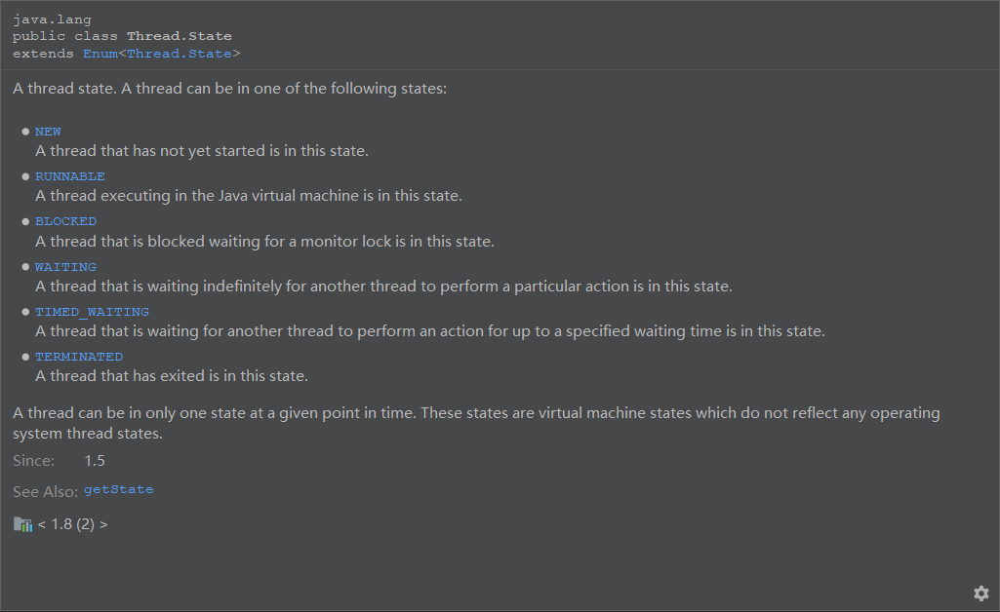

JVM已经学的差不多了，今天开始学习Java并发编程，记录学习笔记。


##  多线程的基本概念

首先还是从基本概念讲起。

### 进程VS线程

**进程**

+ 程序由指令和数据组成，但这些指令要运行，数据要读写，就必须将指令加载到CPU，把数据加载至内存。在指令运行过程中还需要用到用到磁盘、网络等设备，进程就是用来加载指令、管理内存、管理IO的。

+ 当一个程序运行，从磁盘加载这个程序的代码到内存，这时就开启了一个进程。

+ 进程可以视作程序的一个运行实例，大部分程序可以同时运行多个实例进程，有些只能启动一个实例进程。

+ 程序是静态的，而进程是动态的。

#### 线程

+ 一个线程就是一个指令流，将指令流中的一条条指令以一定顺序交给CPU执行。
+ 线程是最小的CPU调度单位。进程作为资源分配的最小单位，在windows中是不活动的，只是作为线程的容器。

### 对比

+ 独立性：进程之间基本上是互相独立的，而同一个进程内可能有多个线程，它们之间相互协作完成进程。
+ 资源角度：进程拥有共享资源，如内存空间，供其内部的线程共享。
+ 通信方式：
  + 进程通信：同一计算机的进程之前通信称为IPC(Inter-process communication)，不同计算机之间的进程通信，需要通过网络，并且遵守共同的协议，如HTTP。
  + 线程通信：线程通信相对简单，因为它们共享进程内的内存。
+ 线程更轻量，线程上下文切换成本一般比进程上下文切换低。


### 并发VS并行

[推荐阅读](https://www.cnblogs.com/f-ck-need-u/p/11161481.html)

单核 cpu 下，线程实际还是串行执行的。操作系统中有一个组件叫做任务调度器，将 cpu 的时间片（windows下时间片最小约为 15 毫秒）分给不同的程序使用，只是由于 cpu 在线程间（时间片很短）的切换非常快，人类感觉同时运行的 。总结为一句话就是： 微观串行，宏观并行 ，一般会将这种  线程轮流使用 CPU 的做法称为**并发**（concurrent）。
多核 cpu下，每个核(core) 都可以调度运行线程，这时候线程可以是**并行(parallel)**的。

关于并发和并行的概念辨析，这里引用Go语言创始人[Rob pike](https://zh.wikipedia.org/wiki/%E7%BE%85%E5%8B%83%C2%B7%E6%B4%BE%E5%85%8B)的描述：

<%blockqoute%>

"Concurrency is about **dealing with** lots of things at once.

 Parallelism is about **doing** lots of things at once"

<%endblockqoute%>

+ 并发是一段时间内应对多个任务的能力(某个时间片内执行一个任务的一部分，下一个时间片可能执行其它任务的一部分，多个任务轮流时间片，通过不同任务之间切换，切换后的任务从上次停止的地方继续)，而并行是一个时间点上同时处理多个任务的能力。

+ 并发是一段时间内某个系统或单元的各个组成部分通过相互配合来处理大量的任务，强调结构和调度，并行是某一时刻多个单元同时在做各自的任务， 强调执行。

## 多线程的应用
+ 异步调用。

  无需等待方法调用。

+ 利用CPU多核优势并行


## Java线程

### 创建并启动线程

创建线程的3种方式。

在Java中，创建线程主要是用到Thread类。

```java
/**
 * @Created by hfq on 2020/5/1
 * @used to: 创建线程的3种方式
 */
@Slf4j(topic = "c.Test1")
public class Test1 {
    /**
     * 创建线程方式1
     */
    public static void test1(){
        Thread t1 = new Thread("myThread1"){
            @Override
            public void run(){
                log.debug("thread 1 start........");
            }
        };
        t1.start();
    }

    /**
     * 创建线程方式2
     */
    public static void test2(){
        Thread t2 = new Thread(new Runnable() {
            @Override
            public void run() {
                log.debug("thread 2 start........");
            }
        },"myThread2");
     //Thread t2 = new Thread(() -> log.debug("thread 2 start........"),"myThread2");

        t2.start();
    }

    /**
     * 创建线程方式3
     */
    public static void test3(){
        FutureTask<Integer> integerFutureTask = new FutureTask<>(new Callable<Integer>() {
            @Override
            public Integer call() throws Exception {
                log.debug("thread 3 start........");
                return null;
            }
        });
        Thread t3 = new Thread(integerFutureTask, "myThread3");
        t3.start();
    }


    public static void main(String[] args) {
        test1();
        test2();
        test3();
        log.debug("main thread start........");
    }

}
```

！！！

【拓展阅读—Java创建涉及的设计模式】

[Thread类涉及到的两种设计模式](https://blog.csdn.net/Dongguabai/article/details/84727545)

[线程类的模板方法设计模式](https://zhuanlan.zhihu.com/p/111789469)

[多线程策略模式](https://www.cnblogs.com/1315925303zxz/p/7238539.html)


### 查看进程和线程的方法

windows：tasklist、taskkill

linux: ps、top、kill

java: jps、jstack、jconsole


### Java操作线程的常见方法

#### start&run

如果在主函数中直接调用线程的 run方法 是在主线程中执行了 run，没有启动新的线程
使用 start 是启动新的线程，通过新的线程间接执行 run 中的代码

#### sleep 与 yield

调用 sleep 会让当前线程从 Running 进入 Timed Waiting 状态（阻塞）

调用 yield 会让当前线程从 Running 进入 Runnable 就绪状态，然后调度执行其它线程

#### 调节线程优先级

setPriority()。Thread.MIN_PRIORITY ：1，Thread.MAX_PRIORITY：10

#### join方法

Thread中，join()方法的作用是调用线程等待该线程完成后，才能继续往下运行。

join()方法还有一个重载方法join(long n) ，等待线程运行结束,最多等待 n毫秒。

#### interrupt方法

打断 sleep，wait，join 的线程

给受阻塞的线程发出一个中断信号，这样受阻线程就得以退出阻塞的状态。
更确切的说，如果线程被Object.wait, Thread.join和Thread.sleep三种方法之一阻塞，此时调用该线程的interrupt()方法，那么该线程将抛出一个 InterruptedException中断异常（该线程必须事先预备好处理此异常），从而提早地终结被阻塞状态。如果线程没有被阻塞，这时调用 interrupt()将不起作用，直到执行到wait(),sleep(),join()时,才马上会抛出 InterruptedException。


待理解 [两阶段终止模式](https://www.jianshu.com/p/c45c743e6376)

#### 守护线程

默认新创建的线程是非守护线程，java进程中主线程和所有非守护线程都结束了才会结束。

设置为守护线程：setDaemon(true)。

垃圾回收器：守护线程


### 线程状态

在操作系统课本上，我们学的是线程有五种状态。

而在Java语言中，一个线程的状态有六种。从jdk Thread类的源码中就可以看到，定义在名称为State枚举中：




### 线程安全问题

多线程对静态变量进行相同次数的自增自减。

thread1	 thread2

a++;   		a--;

a++:取a，计算a+1，写回内存

a--:取a，计算a-1，写回内存


