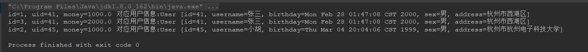

## 问题背景

这是在学习Mybatis框架做学习demo时遇到的问题，特此记录。

现有**用户表**和**账户表**，规定：一个用户可以有多个账户，一个账户对应确定的一个用户，即对于账户记录来说，是一对一的关系。

两张表的记录如下：


现需要使用Mybatis查询出账户表的所有记录，并且需要查询此账户记录对应的用户（利用外键uid）。

sql语句和查询结果如下：

```sql
# 一个简单的内连接查询
select a.id,a.uid,a.money,u.* 
from account a,user u 
where a.uid =u.id;

# 此条sql语句执行的结果：
1	41	1000	41	张三	2000-02-27 17:47:08	男	杭州市西湖区
3	41	2000	41	张三	2000-02-27 17:47:08	男	杭州市西湖区
2	45	1000	45	小胡	1999-03-04 12:04:06	男	杭州市杭州电子科技大学
```

账户类对应的Mapper的xml部分配置如下：

```xml
    <resultMap id="accountMap" type="Account">
        <id property="id" column="id"></id>
        <result property="uid" column="uid"></result>
        <result property="money" column="money"></result>
        <!-- 在Account类中，组合了一个User对象 -->
        <association property="user" column="uid" javaType="User">  
            <id column="id" property="id"></id>
            <result column="username" property="username"></result>
            <result column="birthday" property="birthday"></result>
            <result column="sex" property="sex"></result>
            <result column="address" property="address"></result>
        </association>
      </resultMap>

	<!-- 查询所有账户记录（含用户信息） -->
    <select id="findAll" resultMap="accountMap" >
        select a.id,a.uid,a.money,u.* 
        from account a,user u 
        where a.uid =u.id;
    </select>
```


按照此配置测试，发现结果有两个问题：

1、只查询出两条记录信息，而实际上账户数据表中有三条账户记录。

2、账户id结果有误，两条账户记录的正确id应该分别是id=1和id=2，而不是下图中的41和45。


## 排查解决

排查思路：其实根据上面执行结果出现的第二个问题就大致定位到了问题所在：**账户id打印的是用户id，原因很有可能是因为这两张表的字段id重复，导致无法区分**。

解决思路：为其中的一个id字段起别名，以便区分开来。

```xml
    <resultMap id="accountMap" type="Account">
        ！注意此处的column修改了
        <id property="id" column="accountId"></id>  
     		 ....此部分和修改前一样，故省略
        <association property="user" column="uid" javaType="User">
            <id column="id" property="id"></id>
        	....此部分和修改前一样，故省略
        </association>

    </resultMap>

    <select id="findAll" resultMap="accountMap" >
        ！注意此处为acocount表的id 起了别名accountId。 
        select u.*,a.id as accountId,a.uid,a.money  
        from account a,user u 
        where a.uid =u.id;
    </select>
```

果然，修改后，解决了，得到了正确查询结果。




## 总结

在使用mybatis进行多表联合查询时，如果两张表中的字段名称形同，会出现无法正常映射的问题。

问题解决办法：在SQL查询语句中时，给重复的字段 起别名，然后在column属性使用别名进行映射。