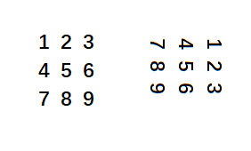
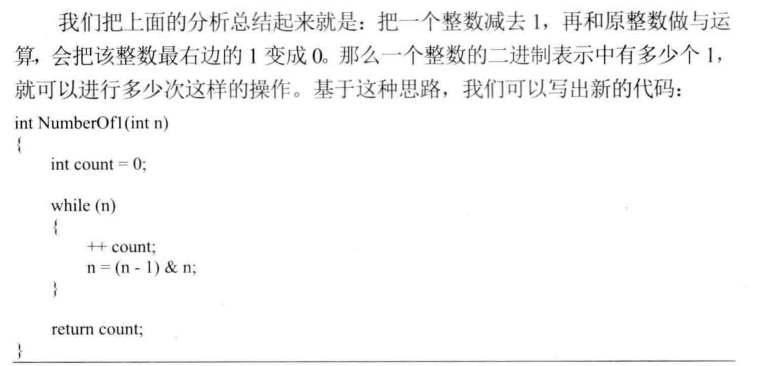
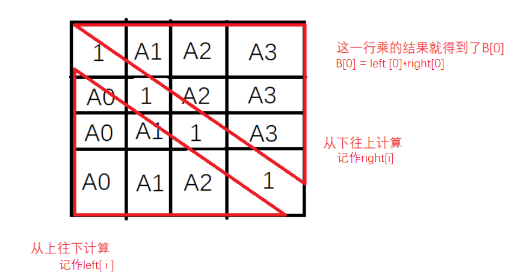

# 20200523 晴天

截止昨日，剑指Offer刷题进度：55/67，Leetcode 22/148 ，已坚持每天刷3题的天数：**10**。


## 题1[回文串判断](https://www.nowcoder.com/practice/b4dc0f1ee20448fca1f387fb1546f43f?tpId=46&tqId=29055&tPage=1&rp=1&ru=/ta/leetcode&qru=/ta/leetcode/question-ranking)

# 20200522 多云

截止昨日，剑指Offer刷题进度：55/67，Leetcode 20/148 ，已坚持每天刷3题的天数：**9**。

## 题1 【待解决】[合法的二叉搜索树](https://www.nowcoder.com/practice/fd7f880072914464a13b89af242c0ce5?tpId=46&tqId=29080&tPage=1&rp=1&ru=/ta/leetcode&qru=/ta/leetcode/question-ranking)

> 判断给出的二叉树是否是一个二叉搜索树（BST）
>
> 二叉搜索树的定义如下
>
> - 一个节点的左子树上节点的值都小于自身的节点值
> - 一个节点的右子树上节点的值都小于自身的节点值
> - 所有节点的左右子树都必须是二叉搜索树

一个月前在Leetcode网站里做过[原题](https://leetcode-cn.com/problems/validate-binary-search-tree/submissions/)，没AC，当时的想法很简单。

```java 
!!!!ATTENTION:这是错误代码！！！
class Solution {
    public boolean isValidBST(TreeNode root) {
        if(root == null)
            return true;
        if(root.left!=null && root.left.val >= root.val){
            return false;
        }
        if(root.right!=null && root.right.val <= root.val){
            return false;
        }
        return isValidBST(root.left) && isValidBST(root.right);
    }
}
```

然后提交出错了，[10,5,15,null,null,6,20]，这个测试用例的正确计算结果应该是false，而用上述递归会是true。

为什么呢？把它画成树状结构就看出来了: 在这棵树中，节点6是在根节点10的右子树（10的右孩子的左孩子），显然不是BST，因为在BST中，一个节点会大于其右子树的所有节点！

P.S：这里吐槽一下牛客网这道题目的测试用例，我在牛客网上提交这份错误代码，本来是想看看能通过百分之几，结果直接AC了，说明其设计用例没有考虑到此类情况。

```java
import java.util.*;

/*
 * public class TreeNode {
 *   int val = 0;
 *   TreeNode left = null;
 *   TreeNode right = null;
 * }
 */

public class Solution {
    /**
     * 
     * @param root TreeNode类 
     * @return bool布尔型
     */
    public boolean isValidBST (TreeNode root) {
        // write code here
        if(root == null)
            return true;
        return isValidBST(root,root.val);
    }
    public boolean isValidBST(TreeNode root,int limit){ 
        //规定右子树节点的下界（minForRightNode）和左子树结点的上界（maxForLeftNode）
        if(root==null)
            return true;
        if(root.left!=null && (root.left.val >= root.val || root.left.val>=limit) ){
            return false;
        }
        if(root.right!=null && (root.right.val <= root.val || root.right.val<=limit) ){
            return false;
        }
        //这一层的结点值是下层左孩子的上限和右孩子下限
        return isValidBST(root.left,root.val) && isValidBST(root.right,root.val);
    }
}
```


```java
class Solution {
    public boolean isValidBST(TreeNode root) {
        // write code here
        if(root == null)
            return true;
        return isValidBST(root,root.val,3);
    }
    public boolean isValidBST(TreeNode root,int limit,int flag){ 
        //limit规定右子树节点的下界（minForRightNode）和左子树结点的上界（maxForLeftNode）
        //flag规定要进行哪一种判断
        if(root==null)
            return true;
        if(root.left!=null && root.left.val >= root.val ){
            return false;
        }
        if(root.right!=null && root.right.val <= root.val){
            return false;
        }
        if(flag==0 && root.right.val>=limit){  //左子树的右孩子要小于限制
            return false;
        }else if(flag==1 && root.left.val<=limit){
            return false;
        }
        //这一层的结点值是下层左孩子的上限和右孩子下限
        return isValidBST(root.left,root.val,0) && isValidBST(root.right,root.val,1);
    }
}
```


## 题2 【改之前的bug】[数值的整数次方](https://www.nowcoder.com/practice/1a834e5e3e1a4b7ba251417554e07c00?tpId=13&tqId=11165&tPage=1&rp=1&ru=/ta/coding-interviews&qru=/ta/coding-interviews/question-ranking)

> 给定一个double类型的浮点数base和int类型的整数exponent。求base的exponent次方。
>
> 保证base和exponent不同时为0

这题之前做过，能AC（牛客没考虑到某测试用例），这次主要是修复上次的bug。

```java
public class Solution {
    public double Power(double base, int exponent) {
        long e2 = exponent;	//之所以要转成long是为了兼容当 exponent= -2^31的情况下,-exponent溢出了
        if(exponent==0)    
            return 1.0;
        if(exponent<0){
            base = 1/base;
            e2 = -e2;
        }
        double tmp = base;
        double res = 1;
        while(e2!=0){
            if((e2 & 1)==1){ //nCopy & 1记录数值n二进制表示最后一位的取值1/0
                res=res*tmp;
            }
            tmp*=tmp;
            e2=e2>>1; //n右移动一位
        }
        return res;

    }

}
```

本来是做下一题的，做完才发现要求中x、n都是double类型的，想起了这道类似题，就想着复习一遍快速幂_[Leetcode上的类似题](https://leetcode-cn.com/problems/powx-n/solution/)，尝试了很久都没AC，。最后才意识到Java 代码中 int32 变量 n∈[−2147483648,2147483647] ，因此当 n = -2147483648，-n=−2147483648 时 会因越界而赋值出错。解决方法是先将 n 存入 long 变量 ，后面用 long类型操作即可。然而之前在牛客同题能AC，说明其测试用例不严谨！


## 题3  【疑惑】[pow-x](https://www.nowcoder.com/practice/0616061711c944d7bd318fb7eaeda8f6?tpId=46&tqId=29129&tPage=1&rp=1&ru=/ta/leetcode&qru=/ta/leetcode/question-ranking)

> 请实现函数 pow(x, n).
>
> Implement pow(x, n).
这道题有个tag是分治法，就用分治法的思想解决吧：快速幂。

？？？n是浮点数 很迷


## 题4 [括号匹配](https://www.nowcoder.com/practice/37548e94a270412c8b9fb85643c8ccc2?tpId=46&tqId=29158&tPage=7&rp=7&ru=/ta/leetcode&qru=/ta/leetcode/question-ranking)

```java
import java.util.*;


public class Solution {
    /**
     * 
     * @param s string字符串 
     * @return bool布尔型
     */
    public boolean isValid (String s) {
        // write code here
        Stack <Character> stack = new Stack<>();
        for(int i=0;i<s.length();i++){
            if(s.charAt(i)=='('||s.charAt(i)=='['||s.charAt(i)=='{')
                stack.push(s.charAt(i));
            else if(s.charAt(i)==')' || s.charAt(i)==']' || s.charAt(i)=='}'){
                if(stack.isEmpty()||!canMatch(stack.pop(),s.charAt(i)))    
                    return false;
            }
        }
        return stack.isEmpty();
    }
    
    public boolean canMatch(char c1,char c2){
        return c1=='('&&c2==')' || c1=='['&& c2==']' || c1=='{'&&c2=='}';
    }
}
```


# 20200521 阴

截止昨日，剑指Offer刷题进度：54/67，Leetcode 18/148 ，已坚持每天刷3题的天数：**9**。

## 题1 【待改进】[二叉搜索树与双向链表](https://www.nowcoder.com/practice/947f6eb80d944a84850b0538bf0ec3a5?tpId=13&tqId=11179&tPage=1&rp=1&ru=/ta/coding-interviews&qru=/ta/coding-interviews/question-ranking)

> 输入一棵二叉搜索树，将该二叉搜索树转换成一个排序的双向链表。要求不能创建任何新的结点，只能调整树中结点指针的指向。

我的想法比较简单：先把中序遍历结果存放在ArrayList里（存节点而不是值），然后在这个list里调整指针的指向，最后返回list中的第一个节点。

能AC，不过应该不是出题者的用意，待改进。

```java
import java.util.ArrayList;
public class Solution {
    public TreeNode Convert(TreeNode pRootOfTree) {
        if(pRootOfTree ==null)
            return null;
        ArrayList <TreeNode> list = new ArrayList<>();
        inorder(pRootOfTree,list);  //此时，list中保存了中序遍历的结果
        for(int i = 0;i<list.size();i++){
            TreeNode node = list.get(i);
            if(i==0){
                node.left = null;
            }else{
                node.left = list.get(i-1);
            }
            if(i==list.size()-1){
                node.right = null;
            }else{
                node.right = list.get(i+1);
            }
        }
        return list.get(0);
    }
    
    public void inorder(TreeNode root,ArrayList list){
        if(root==null)
            return;
        inorder(root.left,list);
        list.add(root);
        inorder(root.right,list);
    }
}
```


## 题2 [two sum](https://www.nowcoder.com/practice/20ef0972485e41019e39543e8e895b7f?tpId=46&tqId=29177&tPage=8&rp=8&ru=/ta/leetcode&qru=/ta/leetcode/question-ranking)

> 给出一个整数数组，请在数组中找出两个加起来等于目标值的数，
>
> 你给出的函数twoSum 需要返回这两个数字的下标（index1，index2），需要满足 index1 小于index2.。注意：下标是从1开始的
>
> 假设给出的数组中只存在唯一解
>
> 例如：
>
> 给出的数组为 {2, 7, 11, 15},目标值为9
> 输出 ndex1=1, index2=2

思路：题目知识点打了个`哈希`标签。于是用了哈希表，把数组的值作为key，把数组的索引（下标）作为value，因为HashMap的查找时间复杂度平均是O(1)，所以这样做用空间换时间是合理的。

写代码的时候要注意题目要求下标是从1开始的，另外就是要注意map.put(target-numbers[i],i+1);  这一行与澳方在判断的后面，否则比如说 测试用例是：[1,0,2,4]，2 ， 正确结果应该是返回[1，2]（0+2=2），而如果先添加再判断，返回结果就变成了[1,1]。

```java
import java.util.HashMap;
public class Solution {
    /**
     * 
     * @param numbers int整型一维数组 
     * @param target int整型 
     * @return int整型一维数组
     */
    public int[] twoSum (int[] numbers, int target) {
        // write code here
        int res [] = new int [2];//存放返回结果
        HashMap <Integer,Integer> map = new HashMap<>(); 
        for(int i = 0; i<numbers.length; i++){
            if(map.containsKey(numbers[i])){
                res[0] = map.get(numbers[i]);
                res[1] = i+1;//记得这里要加1，因为下表要加1
            }
            map.put(target-numbers[i],i+1); //存放自己期待的数(能够和自己相加得到target的数)和自己的下标（从1开始）
        }
        return res;
    }
}
```

## 题3  [右旋转链表](https://www.nowcoder.com/practice/afbec6b9d4564c63b2c149ccc01c5678?tpId=46&tqId=29118&tPage=5&rp=5&ru=/ta/leetcode&qru=/ta/leetcode/question-ranking)

> 将给定的链表向右转动k个位置，k是非负数。
> 例如：
> 给定1->2->3->4->5->null ， k=2，
> 返回4->5->1->2->3->null。

写时感觉代码写的不怎么优雅，有些凌乱，不过竟然一次过了。做这种题最重要的是先理解题目的意思，用实例演算一下，来帮助判断代码中的边界条件

实例演算：

原链表==12345
右移1==**5**1234
右移2==**45**123
右移3==**345**12
右移4==**2345**1
右移5==12345 （复原）

演算几个例子就会发现是有迹可循的，可以定位到节点后一步到位地完成旋转，没必要在循环里一步步旋转。具体说来，思路是：

1.末尾节点指向头结点

2.倒数第k个元素为头结点 

3.倒数第k+1个元素指向null（也就是第2步的前一个结点）

所以我的代码中设置了好几个节点的引用：末尾节点、工作节点p（用来定位尾节点以及倒数第k个节点）、结果节点，反思了一下：我在求倒数第k个节点的时候是先求链表的总长度，再求差值定位，这里可以用快慢指针。

PS 后面又想了想，这里还是有必要求处链表的长度，因为在取余操作也要用到。

**题目本身不难，下一次解答此题的关注点放在怎么写出优美易懂的代码**

```java
public class Solution {

    public ListNode rotateRight (ListNode head, int k) {
        if(head==null)
            return null;
        int len = 0;
        ListNode p = head,tail=head;
        while(p!=null){
            len++;
            tail=p;
            p=p.next;
        }
        k%=len;   //取余操作，把链表的最后k%len个元素拿到链表前面来
        int cnt = 0;
        p=head;
        while(cnt<len-k-1){
            cnt++;
            p=p.next;
        }
        tail.next = head;
        ListNode res = p.next;  //复查代码的时候发现这个res引用没必要，可以直接用head
        p.next = null;
        return res;
    }
}
```


# 20200520 晴

截止昨日，剑指Offer刷题进度：54/67，Leetcode 15/148 ，已坚持每天刷3题的天数：**8**。

## 题1[自底向上的层序遍历](https://www.nowcoder.com/practice/d8566e765c8142b78438c133822b5118?tpId=46&tqId=29071&tPage=3&rp=3&ru=/ta/leetcode&qru=/ta/leetcode/question-ranking)

> 给定一个二叉树，返回该二叉树由底层到顶层的层序遍历，（从左向右，从叶子节点到根节点，一层一层的遍历）

我这里还是按照层序遍历的普通思路，然后调用Collections.reverse(result)，反转ArrayList。还有一个思路是result.add(0,list)，也就是说每次插入都插入到最前面，但是这个方法的时间复杂度太高了（数组头插，其他元素都要后移）。也可以考虑使用LinkedList头插，然后通过ArrayList arrayList = new ArrayList(linkedList);转换成ArrayList ，加到result中。

```java
import java.util.Queue;    
import java.util.LinkedList;
import java.util.Collections;
public class Solution {
    /**
     * 
     * @param root TreeNode类 
     * @return int整型ArrayList<ArrayList<>>
     */
    public ArrayList<ArrayList<Integer>> levelOrderBottom (TreeNode root) {
        // write code here
        if(root==null)
            return new ArrayList<ArrayList<Integer>>();
        Queue<TreeNode> queue = new LinkedList<>();
        queue.offer(root);
        int leftNumToNextLevel = 1;    //到达下一层需要访问的剩余元素个数
        ArrayList<ArrayList<Integer>> result = new ArrayList<ArrayList<Integer>>();
        ArrayList<Integer> list = new ArrayList<>();
        while(!queue.isEmpty()){
            TreeNode node = queue.poll();  //出队列
            list.add(node.val);
            leftNumToNextLevel--;
            if(node.left!=null){
                queue.offer(node.left);
            }
            if(node.right!=null){
                queue.offer(node.right);
            }
            if(leftNumToNextLevel==0){ //已遍历完了一层
                result.add(list);
                list=new ArrayList<>();
                leftNumToNextLevel=queue.size();
            }
        }
        Collections.reverse(result);
        return result;
    }
}
```

## 题2 【待完善】[指定区间内的链表反转](https://www.nowcoder.com/practice/b58434e200a648c589ca2063f1faf58c?tpId=46&tqId=29086&tPage=1&rp=1&ru=/ta/leetcode&qru=/ta/leetcode/question-ranking)

> 将一个链表m位置到n位置之间的区间反转，要求使用原地算法，并且在一次扫描之内完成反转。
>
> 例如：
>
> 给出的链表为1->2->3->4->5->NULL, m = 2 ，n = 4,
>
> 返回1->4->3->2->5->NULL.
>
> 注意：
>
> 给出的m，n满足以下条件：
>
> 1 ≤ m ≤ n ≤ 链表长度

之前我做反转链表的时候用到了栈，需要O(n)级别的空间复杂度，今天刚听说并学了原地反转链表（意味着O（1）级别的空间复杂度）的思路，核心是使用3个移动指针p1、p2、p3和一个定指针tail。

一开始，做这题要考虑的特殊情况很多（比如说是否只有0、1、2个元素，分别做不同处理），根据错误测试用例调整了许久，结果还是只能AC45%： 

看[题解](https://www.nowcoder.com/questionTerminal/b58434e200a648c589ca2063f1faf58c?f=discussion)，很简洁地求解了这个问题，果然，如果发现自己代码中的特殊情况很多，很可能是代码写的不好。

附上我的45%代码，以供日后修正：

```java
public class Solution {
    /**
     * 
     * @param head ListNode类 
     * @param m int整型 
     * @param n int整型 
     * @return ListNode类
     */
    public ListNode reverseBetween (ListNode head, int m, int n) {
        // write code here
        if(head==null || head.next==null) //为空或者只有一个元素
            return head;
        if(head.next.next==null){//只有两个元素
            if(m==1 && n==2){  //这种情况才会有元素需要反转
                ListNode node = head.next;
                node.next = head;
                head.next = null;
                return node;
            }
            return head;
        } 
        ListNode dummy = new ListNode(0);
        dummy.next=head;
        ListNode p1=dummy,p2=p1.next,p3=p2.next,tail=dummy;
        int cur=0;
        while(cur<m && p3!=null){  //此循环的目的是定位tail、p1、p2、p3
            cur++;
            tail=p1;     //记录下tail的位置
            p1=p1.next;
            p2=p1.next;
            p3=p2.next;
        }//退出循环时，cur=m，说明要开始反转动作了
        while(cur<n && p3!=null ){
            //以下三步用于完成反转操作
            tail.next=p2;
            p1.next=p3;
            p2.next=p1;
            //以下三步用于p1、p2、p3前移
            p1=p1.next;
            p2=p2.next;
            p3=p3.next;
            cur++;
        }
        return dummy.next;
    }
}
```

## 题3 [二叉树的层序遍历](https://www.nowcoder.com/practice/04a5560e43e24e9db4595865dc9c63a3?tpId=46&tqId=29076&tPage=1&rp=1&ru=/ta/leetcode&qru=/ta/leetcode/question-ranking)

这道题就是今天做的题1的简单版。直接在其基础上复制了，今天学习时间太长，有点累了，不过每天三题还是要保证的，层序遍历已经很熟悉了，就算是偷个小懒。

## 题4 [之字形二叉树层序遍历](https://www.nowcoder.com/practice/47e1687126fa461e8a3aff8632aa5559?tpId=46&tqId=29075&tPage=1&rp=1&ru=/ta/leetcode&qru=/ta/leetcode/question-ranking)

同上，今天AC的这几题都是一个系列的，今天算是水一下任务。

```java
public class Solution {
    /**
     * 
     * @param root TreeNode类 
     * @return int整型ArrayList<ArrayList<>>
     */
    public ArrayList<ArrayList<Integer>> zigzagLevelOrder (TreeNode root) {
        // write code here
        if(root==null)
            return new ArrayList<ArrayList<Integer>>();
        Queue<TreeNode> queue = new LinkedList<>();
        queue.offer(root);
        int leftNumToNextLevel = 1;    //到达下一层需要访问的剩余元素个数
        ArrayList<ArrayList<Integer>> result = new ArrayList<ArrayList<Integer>>();
        ArrayList<Integer> list = new ArrayList<>();
        boolean leftToRight = true;
        while(!queue.isEmpty()){
            TreeNode node = queue.poll();  //出队列
            list.add(node.val);
            leftNumToNextLevel--;
            if(node.left!=null){
                queue.offer(node.left);
            }
            if(node.right!=null){
                queue.offer(node.right);
            }
            if(leftNumToNextLevel==0){ //已遍历完了一层
                if(!leftToRight){ //如果不是从左向右，说明要反转
                    Collections.reverse(list);
                }
                result.add(list);
                list=new ArrayList<>();
                leftNumToNextLevel=queue.size();
                leftToRight^=true;  //leftToRight取反
            }
        }
        return result;
    }
}
```


# 20200519 晴

截止昨日，剑指Offer刷题进度：54/67，Leetcode 12/148 ，已坚持每天刷3题的天数：**7**。

## [rotate-image顺时针旋转矩阵](https://www.nowcoder.com/practice/4018c0c6d15d473e804656afcbc2c501?tpId=46&tqId=29131&tPage=2&rp=2&ru=/ta/leetcode&qru=/ta/leetcode/question-ranking)

> 给出一个用二维矩阵表示的图像
>
> 返回该图像顺时针旋转90度的结果
>
> 扩展：
>
> 你能使用原地算法解决这个问题么？



## 题1 [有序链表合并]()

> 将两个有序的链表合并为一个新链表，要求新的链表是通过拼接两个链表的节点来生成的。

这题想了很久才理清思路，实在不应该。


``` java
public class Solution {
    public ListNode mergeTwoLists(ListNode l1, ListNode l2) {
        if(l1==null) return l2;
        if(l2==null) return l1;
        ListNode m = l1; //这两个变量没必要，可以直接使用l1、l2
        ListNode n = l2;
        ListNode res = new ListNode(0); //先随便指定一个无意义的头节点（以遍后续代码统一）
        ListNode tail = res; //尾结点
        while(m!=null && n!=null){
            if(m.val>n.val){  //l2的当前结点比较小
                tail.next=n;
                n=n.next;
            }else{  //l1的当前结点比较小
                tail.next=m;
                m=m.next;
            }
            tail=tail.next;
        }
        tail.next=(m==null?n:m); 
        return res.next;  //记得返回的是res.next。
  }
}
```


## 题2 [查找二维数组中的数](https://www.nowcoder.com/practice/5145394607ea4c5f8b25755718bfddba?tpId=46&tqId=29104&tPage=2&rp=2&ru=/ta/leetcode&qru=/ta/leetcode/question-ranking)

> 请写出一个高效的在m*n矩阵中判断目标值是否存在的算法，矩阵具有如下特征：
>
> 每一行的数字都从左到右排序, 每一行的第一个数字都比上一行最后一个数字大

```java
public class Solution {
    public boolean searchMatrix(int[][] matrix, int target) {
        if(matrix==null || matrix[0]==null)
            return false;
        //思路：从左下角开始找
        int curI=matrix.length-1,curJ=0; //分别表示当前数字的纵坐标和横坐标
        while(curI>=0 && curJ<=matrix[0].length-1){
            if(target<matrix[curI][curJ]){
                curI--; //当前数字要变小，往上走
            }else if(target>matrix[curI][curJ]){
                curJ++; //当前数字要变大，往右走
            }else
                return true;
        }
        return false;
    }
}
```

## 题3 [两链表的数相加](https://www.nowcoder.com/practice/56f8d422eae04f129c8e5a05299ae275?tpId=46&tqId=29174&tPage=8&rp=8&ru=/ta/leetcode&qru=/ta/leetcode/question-ranking)

> 给定两个代表非负数的链表，数字在链表中是反向存储的（链表头结点处的数字是个位数，第二个结点上的数字是百位数...），求这个两个数的和，结果也用链表表示。
>
> 输入：(2 -> 4 -> 3) + (5 -> 6 -> 4)
>
> 输出： 7 -> 0 -> 8

题目本身不难，考虑得全面一点就好了。

``` java
public class Solution {
    //需要考虑：诸如5+5的情况，正确结果应该是01
    //需要考虑: l1和l2长度不一样的情况,我这里的处理方式是空时也放在循环内，+0
    public ListNode addTwoNumbers(ListNode l1, ListNode l2) {
        ListNode head = new ListNode(0);//无意义的头节点
        ListNode tail = head;
        int carry = 0; //下次计算的进位
        while(l1!=null || l2!=null){
            int temp = (l1==null?0:l1.val)+(l2==null?0:l2.val)+carry; //这一位的相加结果
            if(temp>=10){
                temp-=10;
                carry=1;
            }else{
                carry=0;
            }
            tail.next = new ListNode(temp); 
            tail=tail.next;
            l1=(l1==null?l1:l1.next);
            l2=(l2==null?l2:l2.next);
        }
        if(carry==1){ //如果最后还有进位，末尾再加一个1
            tail.next = new ListNode(1);
        }
        return head.next;
    }
}
```


# 20200518 晴

截止昨日，剑指Offer刷题进度：54/67，Leetcode 6/148 ，已坚持每天刷3题的天数：**6**。

## 题1 [非递归二叉树后序遍历](https://www.nowcoder.com/practice/32af374b322342b68460e6fd2641dd1b?tpId=46&tqId=29035&tPage=1&rp=1&ru=/ta/leetcode&qru=/ta/leetcode/question-ranking)

```java
import java.util.Stack;
import java.util.ArrayList;
public class Solution {
    public ArrayList<Integer> postorderTraversal(TreeNode root) {
        if(root==null)
            return new ArrayList<>();
        Stack <TreeNode> stack  = new Stack<>(); 
        ArrayList <Integer> list = new ArrayList<>();
        stack.push(root);  //先加入根节点
        while(!stack.isEmpty()){
            TreeNode node = stack.peek();
            if(node.left==null && node.right==null){
                list.add(stack.pop().val);
            }else{
                if(node.right!=null)
                    stack.push(node.right);
                if(node.left!=null)
                    stack.push(node.left);
                node.right=null;
                node.left=null;
            }

        }
        return list;
    }
}
```

分析：用**栈**实现，后序访问次序是左右根，所以按照根、右、左的次序依次加入栈，比如说求root的后序序列，就是先将root结点压栈，再将root.right压栈，再将root.left压栈（当left和right都非空的情况下），最后将root.left压栈这一步也就是压入了左子树的根节点，此时再检查栈顶节点是否是叶子结点（也就是判断是否还有孩子），如果是叶子节点，就出栈加到list中，**如果不是，就依旧按照右孩子、左孩子的次序压栈，且把栈顶的该结点的right和left都置为空，这样的话下次再访问该栈顶元素，第一个if条件成立,就加入list了。**

这个做法是前几天我学了非递归前序遍历后想出来的，可以AC，不过稍加分析，有明显缺陷：

``` 。java
node.right=null;
node.left=null;

这两行代码破坏了原二叉树的结构。
```


根据上图思路，改进后：

```java
/**
 * Definition for binary tree
 * public class TreeNode {
 *     int val;
 *     TreeNode left;
 *     TreeNode right;
 *     TreeNode(int x) { val = x; }
 * }
 */
import java.util.Stack;
import java.util.ArrayList;
public class Solution {
    public ArrayList<Integer> postorderTraversal(TreeNode root) {
        if(root==null)
            return new ArrayList<>();
        Stack <TreeNode> stack  = new Stack<>(); 
        ArrayList <Integer> list = new ArrayList<>();
        //TreeNode node = root;
        stack.push(root);  //先加入根节点
        TreeNode frontNode=root; //初始化为root，如果初始化为null会有问题。
        while(!stack.isEmpty()){
            TreeNode node = stack.peek();
            if((node.left==null && node.right==null) || frontNode==node.left||frontNode==node.right  ){
                frontNode = stack.pop();
                list.add(frontNode.val);
            }else{
                if(node.right!=null)
                    stack.push(node.right);
                if(node.left!=null)
                    stack.push(node.left);
            }

        }
        return list;
    }
}
```


## 题2[二叉树路径和](https://www.nowcoder.com/practice/508378c0823c423baa723ce448cbfd0c?tpId=46&tqId=29067&tPage=2&rp=2&ru=/ta/leetcode&qru=/ta/leetcode/question-ranking) 

> 给定一个二叉树和一个值sum，判断是否有从根节点到叶子节点的节点值之和等于sum的路径。

递归实现，体现了分治法的策略。

```java
public class Solution {
    public boolean hasPathSum(TreeNode root, int sum) {
        if(root==null)
            return false;
        if(root.left==null && root.right==null){ //是叶子结点
            return sum==root.val;
        }
        return hasPathSum(root.left,sum-root.val) || hasPathSum(root.right,sum-root.val);
    }
}
```


## 题3 【未解决】 [有序单链表转平衡BST](https://www.nowcoder.com/practice/86343165c18a4069ab0ab30c32b1afd0?tpId=46&tqId=29069&tPage=2&rp=2&ru=/ta/leetcode&qru=/ta/leetcode/question-ranking)


## 题4 [平衡二叉树判断](https://www.nowcoder.com/practice/f4523caf0205476985516212047ac8e7?tpId=46&tqId=29068&tPage=2&rp=2&ru=/ta/leetcode&qru=/ta/leetcode/question-ranking)

> 判断给定的二叉树是否是平衡的
>
> 在这个问题中，定义平衡二叉树为每个节点的左右两个子树高度差的绝对值不超过1的二叉树.

```java
public class Solution {
    private boolean flag=true;
    public boolean isBalanced(TreeNode root) {
        getHeight(root);
        return flag;
    }
    public int getHeight(TreeNode root){  
        if(root==null || !flag) //如果flag已经是false，就没必要算了
            return 0;
        int leftHeight = getHeight(root.left);
        int rightHeight = getHeight(root.right);
        int diff = leftHeight - rightHeight;
        if(Math.abs(diff)>1){  //递归计算高度的同时进行平衡判断
            flag=false;
        }
        return 1+Math.max(leftHeight,rightHeight);
    }
}
```

递归解法，用了成员变量作为标志，不太优雅。。


# 20200517 雨转晴

截止昨日，剑指Offer刷题进度：54/67，Leetcode 6/148 ，已坚持每天刷3题的天数：**5**。

换个策略，按照通过率从高到低刷题。

> 假设你有一个数组，其中第i个元素表示某只股票在第i天的价格。
> 设计一个算法来寻找最大的利润。你可以完成任意数量的交易(例如，多次购买和出售股票的一股)。但是，你不能同时进行多个交易(即，你必须在再次购买之前卖出之前买的股票)。

思路：每天都考虑是否要买。有赚就买，亏损则不买。

## 题1 [买卖股票的最佳时间2](https://www.nowcoder.com/practice/572903b1edbd4a33b2716f7649b4ffd4?tpId=46&tqId=29058&tPage=1&rp=1&ru=/ta/leetcode&qru=/ta/leetcode/question-ranking)

```java
public class Solution {
    public int maxProfit(int[] prices) {
       //每天都考虑是否要卖出
       int res=0;
        for(int i=0;i<prices.length-1;i++){
           int diff = prices[i+1]-prices[i];    //计算本日与昨日的盈利额
           if(diff>0)
               res+=diff;
       } 
       return res;
    }
}
```

## 题2 [container-with-most-water 盛放最多水的容器](https://www.nowcoder.com/practice/c97c1400a425438fb130f54fdcef0c57?tpId=46&tqId=29167&tPage=1&rp=1&ru=/ta/leetcode&qru=/ta/leetcode/question-ranking)

这题有印象，之前好像在leetcode做过。本来一直在按照动态规划的思路做，后来才意识到，这是一道双指针的题。而且两边的指针要从中间开始向两边，而不是从两边开始。


public class Solution {
    public int maxArea(int[] height) {
        if(height==null||height.length==1)
            return 0;
        int dp [] = new int[height.length]; //dp[i]表示以height[i]结束的容器的最大盛水量
        int tempMax = height[0];    //记录当前最高的下标（因为要计算长度），也就是height[i]之前的最大值
        for(int i=1;i<dp.length;i++){
            if(height[i-1]>tempMax){
                tempMax=height[i-1];
            }
            dp[i]=dp[i]*Math.max(height[]);
        }
    }
}


## 题3 [same-tree]

> 给出两个二叉树，请写出一个判断两个二叉树是否相等的函数。
>
> 判断两个二叉树相等的条件是：两个二叉树的结构相同，并且相同的节点上具有相同的值。

最简单的递归了， 面试遇到这个题能笑出声。

```java
public class Solution {
    public boolean isSameTree(TreeNode p, TreeNode q) {
        if(p==null && q==null)
            return true;
        else if(p==null || q==null)
            return false;
        return p.val==q.val && isSameTree(p.left,q.left) && isSameTree(p.right,q.right);
    }
}
```


## [二分查找](https://www.nowcoder.com/practice/dd8b0e374dd44be29d6211e540524dd5?tpId=46&tqId=29144&tPage=1&rp=1&ru=/ta/leetcode&qru=/ta/leetcode/question-ranking)

> 给出一个有序的数组和一个目标值，如果数组中存在该目标值，则返回该目标值的下标。如果数组中不存在该目标值，则返回如果将该目标值插入这个数组应该插入的位置的下标
> 假设数组中没有重复项。
> 下面给出几个样例：
> [1,3,5,6], 5 → 2
> [1,3,5,6], 2 → 1
> [1,3,5,6], 7 → 4
> [1,3,5,6], 0 → 0

```java
public class Solution {
    public int searchInsert(int[] A, int target) {
        int l = 0,r=A.length-1,m;    //分别表示left，right,mid
        while(l<=r){
            m = (r-l)/2+l;
            if(A[m]==target){
                return m;
            }else if(A[m]>target){ //说明要在左边找
                r=m-1;
            }else{
                l=m+1;
            }
        }
        return l;
    }
}
```


# 20200516 多云

截止昨日，剑指Offer刷题进度：54/67，Leetcode 3/148 ，已坚持每天刷3题的天数：**4**。

## 题1 [判断链表有环](https://www.nowcoder.com/practice/650474f313294468a4ded3ce0f7898b9?tpId=46&tqId=29039&tPage=1&rp=1&ru=/ta/leetcode&qru=/ta/leetcode/question-ranking)

思路：快慢指针都从链表的头节点出发，然后快指针每次走两步，慢指针每次走一步，如果有环，它们迟早会相遇。 之前，剑指Offer做过比这难的，还要求求出进入环的那个结点，做了那题在做这题就是小意思了。

```java
public class Solution {
    public boolean hasCycle(ListNode head) {
        ListNode fast = head, slow=head;
        while(fast!=null&&fast.next!=null){
            fast=fast.next.next; //每次走两步
            slow=slow.next;     //每次走一步
            if(fast==slow){
                return true; 
            }
        }
        return false;
    }
}
```

## 题2[single-number](https://www.nowcoder.com/practice/0bc646909e474ac5b031ec6836a47768?tpId=46&tqId=29044&tPage=1&rp=1&ru=/ta/leetcode&qru=/ta/leetcode/question-ranking)

> 现在有一个整数类型的数组，数组中素只有一个元素只出现一次，其余的元素都出现两次。
>
> **注意：**
>
> 你需要给出一个线性时间复杂度的算法，你能在不使用额外内存空间的情况下解决这个问题么？

思路：位运算。 a ^ a = 0，0 ^ x = x

```java
public class Solution {
    public int singleNumber(int[] A) {
        int res = 0;
        for(int i = 0;i<A.length;i++){
            res^=A[i];
        }
        return res;
        
    }
}
```

## 题3 [深拷贝带随机指针的链表](https://www.nowcoder.com/practice/60e43001345241ba9266cb4ee6fc6350?tpId=46&tqId=29042&tPage=1&rp=1&ru=/ta/leetcode&qru=/ta/leetcode/question-ranking)

> 现在有一个这样的链表：链表的每一个节点都附加了一个随机指针，随机指针可能指向链表中的任意一个节点或者指向空。
>
> 请对这个链表进行深拷贝。

剑指Offer做过，权当是复习了。

分三步骤： 

+ 第一次遍历，在原链表原地复制每个结点（在原链表的每个结点之后插入它的复制结点），先不用例会它的随机指针。

+ 第二次遍历，为新复制的结点指定random指针。
+ 第三次遍历，分离原链表和复制链表。

思路很正确，一直卡在了一个点。**注意随机指针可能是空**。题目还特意提示了，我一直没考虑到这一点，早点看题目就能发现了，然而我一直盯着代码找bug所以一直没想到。

```java
public class Solution {
    public RandomListNode copyRandomList(RandomListNode head) {
        if(head==null)
            return null;
        RandomListNode p = head; 
        while(p != null){  
            RandomListNode copyNode = new RandomListNode(p.label);
            copyNode.next = p.next;
            p.next = copyNode;
            p = copyNode.next;
        }
        p = head;
        RandomListNode q = head;
        while(p!=null && p.next!=null){ 
            q = p.next;    
            if(p.random != null){
                q.random = p.random.next;
            }else{
                q.random = null;
            }
            p = p.next.next;
        }
        p = head;
        q = head.next;
        RandomListNode res = q;
        while(q!=null&&q.next!=null){
            p.next = p.next.next;
            q.next = q.next.next;
            p = p.next;
            q = q.next;
        }
        return res;
    }
}
```


# 20200515 雨

截止昨日，剑指Offer刷题进度：54/67 ，已坚持每天刷3题的天数：**3**。

从今天开始，开始刷[牛客网上的Leetcode精选题](https://www.nowcoder.com/ta/leetcode)，剑指Offer剩下的13题都没啥思路，先放一放，回头说不定会有想法。

## 题1  [二叉树的最小深度](https://www.nowcoder.com/practice/e08819cfdeb34985a8de9c4e6562e724?tpId=46&tqId=29030&tPage=1&rp=1&ru=/ta/leetcode&qru=/ta/leetcode/question-ranking)

> 求给定二叉树的最小深度。最小深度是指树的根结点到最近叶子结点的最短路径上结点的数量。

思路：

迭代的方法：层序遍历二叉树，记录层数，一旦发现了叶子结点，返回当前记录的层数。

递归的方法：略。


```java
## 先提供一种错误解法
！！！错误解法
public class Solution {
    public int run(TreeNode root) {
        return minHeight(root);
    }
    public int minHeight(TreeNode root){
        if(root==null)
            return 0;
        if(root.left==null && root.right==null)
            return 1;
        return 1+Math.min(minHeight(root.left),minHeight(root.right));
    }
} 
比如说树是
    1
 2       这样做，会认为最小深度是 mimHeight(1) = 1+min{minHeight(2)，minHeight(null)},结果是1，实际上结果是2
```

层序遍历实现。成功AC。

```java
import java.util.Queue;
import java.util.LinkedList;
public class Solution {
    public int run(TreeNode root) {
        if(root==null)
            return 0;
        Queue <TreeNode> queue = new LinkedList<>();
        queue.offer(root);
        int leftNumToNextLevel = 1; //到下一层的剩余数,(再层序访问leftNumToNextLevel个结点到达下一层)
        int cnt = 1;       //最小层数
        while(queue.size()!=0){
            TreeNode node = queue.poll(); 
            leftNumToNextLevel--;
            if(node.left==null && node.right==null){
                break;
            }
            if(node.left!=null){
                queue.offer(node.left);
            }
            if(node.right!=null){
                queue.offer(node.right);
            }
            if(leftNumToNextLevel==0){
                leftNumToNextLevel  = queue.size();
                cnt++;
            }
        }
        return cnt;
        
    }
}
```

## 题2 [evaluate-reverse-polish-notation](https://www.nowcoder.com/practice/22f9d7dd89374b6c8289e44237c70447?tpId=46&tqId=29031&tPage=1&rp=1&ru=/ta/leetcode&qru=/ta/leetcode/question-ranking)

## 题1 []()

> 计算逆波兰式（后缀表达式）的值
>
> 运算符仅包含"+","-","*"和"/"，被操作数可能是整数或其他表达式
>
> 例如：


## 题3 [max-points-on-a-line](https://www.nowcoder.com/practice/bfc691e0100441cdb8ec153f32540be2?tpId=46&tqId=29032&tPage=1&rp=1&ru=/ta/leetcode&qru=/ta/leetcode/question-ranking)

> 对于给定的n个位于同一二维平面上的点，求最多能有多少个点位于同一直线上


## 题4 二叉树的前序遍历（非递归方法）

思路： 首先打印根结点，然后打印左子树的根节点，若右子树不为空，把右子树的根节点压入栈。**注意右子树可能还有孩子，所以不能直接遍历栈的元素，而是要用处理根节点同样的方法处理右孩子**。

```java
！！！能AC，但是不推荐
import java.util.Stack;
import java.util.ArrayList;
public class Solution {
    Stack <TreeNode> stack = new Stack<>();
    ArrayList <Integer> list = new ArrayList<>();
    public ArrayList<Integer> preorderTraversal(TreeNode root) {
        if(root==null)
            return list;
        pre(root);
        while(stack.size()!=0){
            TreeNode right = stack.pop();
            pre(right);  //right是原来右子树的一部分。 
        } 
        return list;
    }
    
    public void pre(TreeNode root){
        if(root==null)
            return;
        while(root!=null){
            list.add(root.val);
            if(root.right!=null){
               stack.push(root.right);
            }
            root=root.left;
        }
        
    }
}
```

这是我自己想到的思路，不过代码不太优雅。附上一个更加简洁的思路：

根据此思路改进后的代码：

```java
    public ArrayList<Integer> preorderTraversal(TreeNode root) {
        if(root==null)
            return new ArrayList<>();
        Stack <TreeNode> stack = new Stack<>();
        ArrayList <Integer> list = new ArrayList<>();
        stack.add(root);
        while(stack.size()!=0){
            TreeNode node = stack.pop();
            list.add(node.val);
            if(node.right!=null){
                stack.push(node.right);
            }
            if(node.left!=null){
                stack.push(node.left);
            }
        }
        return list;
    }
```

相似题目：

中序遍历二叉树的非递归


后序遍历二叉树的非递归写法


## 题5 [maximum-depth-of-binary-tree二叉树的最大深度](https://www.nowcoder.com/practice/8a2b2bf6c19b4f23a9bdb9b233eefa73?tpId=46&tqId=29074&tPage=1&rp=1&ru=/ta/leetcode&qru=/ta/leetcode/question-ranking)

```java
public class Solution {
    public int maxDepth(TreeNode root) {
        if(root==null)
            return 0;
        return Math.max(maxDepth(root.left),maxDepth(root.right))+1;
    }
}
```


# 20200514 晴

##  题1 【待改进】[滑动窗口的最大值](https://www.nowcoder.com/practice/1624bc35a45c42c0bc17d17fa0cba788?tpId=13)

> 给定一个数组和滑动窗口的大小，找出所有滑动窗口里数值的最大值。例如，如果输入数组{2,3,4,2,6,2,5,1}及滑动窗口的大小3，那么一共存在6个滑动窗口，他们的最大值分别为{4,4,6,6,6,5}； 针对数组{2,3,4,2,6,2,5,1}的滑动窗口有以下6个： {[2,3,4],2,6,2,5,1}， {2,[3,4,2],6,2,5,1}， {2,3,[4,2,6],2,5,1}， {2,3,4,[2,6,2],5,1}， {2,3,4,2,[6,2,5],1}， {2,3,4,2,6,[2,5,1]}。

思路:

用一个长度为size的数组记录当前的窗口，并为此数组设置一个指针，这个指针指向下一个要替换的元素位置。

每走一步，就重新计算一下这个窗口的最小值。

最基础的思路的代码：

```java
import java.util.ArrayList;

public class Solution {
    public ArrayList<Integer> maxInWindows(int [] num, int size)
    {
        if(size<=0|| size>num.length)
            return new ArrayList<>();
        ArrayList<Integer> list = new ArrayList<>();
        int window[] = new int [size];    //记录当前滑动窗口的值
        int curr = size-1;    //下一个替换的指针
        for(int i=0;i<size-1;i++){
            window[i] = num[i]; 
        }
        for(int i=size-1;i<num.length;i++){
            window[curr]=num[i];
            curr=(curr+1)%size;
            int max=Integer.MIN_VALUE;
            for(int j = 0; j<size; j++){  //每次重新计算滑动窗口的最小值
                if(window[j]>max){
                    max=window[j];
                }
            }
            list.add(max);
        }
        return list;
    }
}
```

做完了反思: 这样做多此一举了，还不如直接设置两个指针，在原数组上直接计算，没必要单独为窗口开辟空间。


## 题2[不用加减乘除做加法](https://www.nowcoder.com/practice/59ac416b4b944300b617d4f7f111b215?tpId=13)

> 写一个函数，求两个整数之和，要求在函数体内不得使用+、-、*、/四则运算符号。

看到题目描述，不用加减乘除运算做加法很可能和位运算有关。

参考了大佬的[题解](https://blog.nowcoder.net/n/07f2bd03162d40ddaebefd666e0d71b2?f=comment)后豁然开朗。

简而言之，如果x & y  = 0，说明x+y两个数任意位上都不存在进位，结果就是 x ^ y，如 100+001 = 100 ^ 001 = 101，而如果x & y !=0，那就说明两数相加必有进位。这时候我们依旧是先计算 x ^ y， 作为没有处理进位的加法，再在此基础上考虑进位 : (x&y) 计算出应该进位的位<<1，得到进位结果 再加 不考虑进位的结果x^y ，得到结果。。

```java
public class Solution {
    public int Add(int num1,int num2) {
        int res = num1 ^ num2;    
        //int carry = 0 ; 		//表示进位结果
        while(true){
            res = num1 ^ num2;
            if((num1 & num2)!=0){ //说明结果应该有进位 
                num2 = ((num1&num2)<<1);  //注意这一行和下一行的位置不能颠倒，这里应该用个提前记录变量比较好，应该用个变量记录num1&num2的结果，代码比较清楚，也不用考虑两行的位置颠倒的问题。
                num1 = res;
            }else{
                break;
            }
        }
        return res;
    }
}
```


```java
//从评论看到的递归解法，有助于理理思路，写的话还是迭代写法。
class Solution {
public:
int Add(int num1, int num2)
{
    int n=(num1^num2);
    int m=(num1&num2)<<1;
    if(m==0)return n;
    return Add(n,m);
}
};
```


## 题3[对称的二叉树](https://www.nowcoder.com/practice/ff05d44dfdb04e1d83bdbdab320efbcb?tpId=13)

关键是想到先写一个判断两棵树是不是对称的辅助方法。

```java
public class Solution {
    boolean isSymmetrical(TreeNode node1,TreeNode node2){ //判断以node1和node2为根节点的树是否是镜像的
        if(node1==null && node2==null){
            return true;
        }else if(node1==null || node2 ==null){  //其中一个为空，另一个不为空
            return false;
        }else{ //都不为空
            return node1.val==node2.val && isSymmetrical(node1.left,node2.right) && isSymmetrical(node1.right,node2.left) ;
        }
    }
    
    boolean isSymmetrical(TreeNode pRoot)
    {
        if(pRoot==null)
            return true;
       return isSymmetrical(pRoot.left,pRoot.right);
    }
}
```


# 20200513 晴

目前进度：48/67

## 题1 【未完成】[二叉搜索树与双向链表](https://www.nowcoder.com/practice/947f6eb80d944a84850b0538bf0ec3a5)

> 输入一棵二叉搜索树，将该二叉搜索树转换成一个排序的双向链表。要求不能创建任何新的结点，只能调整树中结点指针的指向。

解题思路：

BST要变成**排序的**双向链表，所以极有可能和中序遍历有关。


## 题2 【待改进】 [孩子们的游戏(圆圈中最后剩下的数)](https://www.nowcoder.com/practice/f78a359491e64a50bce2d89cff857eb6?tpId=13)

数组实现：代码很不优雅，不过可以正确AC

```java
public class Solution {
    public int LastRemaining_Solution(int n, int m) {
        if(n==0){
           return -1; 
        }
        //数组实现
        boolean out [] = new boolean[n];  //记录每个人的出列状态
        int left = n;    //记录当前队列剩余人数 
        int j = -1;    //报数计数器
        while(true){
            for(int i=0; i<n ;i++){
                if(out[i] == false){
                    j++; //报数
                    if(j==m-1){
                        out[i]=true;    //此人出列
                        left--;
                        j=-1;
                    }
                }
            }
        if(left==1){ //只剩余一个人
             break;
        }
       }
       for(int i=0;i<n;i++){
           if(out[i]==false){
               return i;
           }
       }
       return -1; 
    }
}
```

## 题3 [链表中环的入口结点](https://www.nowcoder.com/practice/253d2c59ec3e4bc68da16833f79a38e4?tpId=13)

没啥思路，参照了牛客网大佬的题解图，豁然开朗。


```java
public class Solution {

    public ListNode EntryNodeOfLoop(ListNode pHead)
    {
        if(pHead==null || pHead.next==null)
            return null;
        ListNode fast=pHead,slow=pHead;
        while(fast!=null || fast.next!=null){
            fast=fast.next.next;
            slow=slow.next;
            if(fast==slow){    //fast和slow相遇了
                ListNode p = pHead;
                while(p!=slow){
                    p=p.next;
                    slow=slow.next;
                }
                return slow;
            }
        }
        return null;   
        
    }
}
```


## 题4 [求1+2+3+.....+n]()(https://www.nowcoder.com/practice/7a0da8fc483247ff8800059e12d7caf1?tpId=13)

> 求1+2+3+...+n，要求不能使用乘除法、for、while、if、else、switch、case等关键字及条件判断语句（A?B:C）。

```java
public class Solution {
    public int Sum_Solution(int n) {
        int res=n;
        boolean continuee = (res>0)  && ((res+=Sum_Solution(n-1))>0) ;
        return res;
    }
}
```

江湖人称：短路求值


# 20200512 晴

## 题1 [二叉搜索树的后序遍历序列](https://www.nowcoder.com/practice/a861533d45854474ac791d90e447bafd)

> 输入一个非空整数数组，判断该数组是不是某二叉搜索树的后序遍历的结果。如果是则输出Yes,否则输出No。假设输入的数组的任意两个数字都互不相同。

思路:   写代码前先理清二叉搜索树的后序遍历有什么特征 :

后序遍历的顺序无非就是左->右->根。

最后一个遍历的元素是根节点，而由于是BST，所以可以根据和根节点比较来判断其是左子树的一部分还是右子树的一部分。

如下面这棵树的后序遍历结果是132，根据这个序列可知根节点是2，小于2的部分（这里只有1）是左子树，大于2的部分（这里只有3）是右子树。

如何把我们发现的特征转化为代码实现呢： 左边开始一部分小于根节点（也可能是空），属于左子树，一旦出现了一个大于根节点的，就属于右子树（同样也有可能是空），如果后面再次出现了取值小于根节点的取值，说明不可能是二叉搜索树的遍历结果，返回false，如果没有出现过，则在这一次调用没有发现问题，再递归调用其左右子树的序列检查左右子树是否符合要求。

转一个来自牛客网大佬的定义便于理解，一开口就是老递归了：

> BST的后序序列的合法序列是，对于一个序列S，最后一个元素是x （也就是根），如果去掉最后一个元素的序列为T，那么T满足：T可以分成两段，前一段（左子树）小于x，后一段（右子树）大于x，且这两段（子树）都是合法的后序序列。完美的递归定义 : ) 。

```java
public class Solution {
    public boolean VerifySquenceOfBST(int [] sequence) {
        if(sequence==null|| sequence.length == 0)   //因为题目说了是非空序列。
            return false;
        return VerifySquenceOfBST(sequence,0,sequence.length-1);
    }
    public boolean VerifySquenceOfBST(int [] a,int begin,int end){
        if(begin>=end){	//这个条件可以优化成end-begin>=2，即表示数组序列只有3个以内的元素，可以直接返回真，因为三个即以下元素。
             return true;
        }
        int i = begin;
        while(a[i]<a[end]){ //说明 下标为begin的元素属于左子树
            i++;
        }
        //结束循环了，说明此时a[i] > a[end]，从现在开始，后面所有元素都应该大于a[end]
        int mid = i;  //i继续往前走之前，先记录左子树和右子树元素的分界点
        for(i=i+1;i<end;i++){
            if(a[i]<a[end])
                return false;
        }
        return VerifySquenceOfBST(a,begin,mid-1) && VerifySquenceOfBST(a,mid+1,end-1);
    }
}
```


## 题2 [重建二叉树](https://www.nowcoder.com/practice/8a19cbe657394eeaac2f6ea9b0f6fcf6)

>输入某二叉树的前序遍历和中序遍历的结果，请重建出该二叉树。假设输入的前序遍历和中序遍历的结果中都不含重复的数字。例如输入前序遍历序列{1,2,4,7,3,5,6,8}和中序遍历序列{4,7,2,1,5,3,8,6}，则重建二叉树并返回。

### 下次做题时的提示

编写一个方法：public TreeNode recur(int [] pre,int [] in,int i1,int j1,int i2,int j2)

用求前序序列为pre[i1...j1]、中序序列为in[i2...j2]的根节点

### 解题思路

前序列序：1,2,4,7,3,5,6,8 

中序序列：4,7,2,1,5,3,8,6

由于前序遍历序列访问次序是**根左右**，第一个元素必定是根节点，所以所求树的根节点是1，这时我们再去中序遍历序列中找到根节点1，其左边的所有元素构成了左子树的中序遍历序列，而其右边的所有元素构成了右子树的中序遍历序列，（因为中序遍历次序是**左根右**，所以根节点在此序列中划分了左右子树）。找到了根节点1，发现了其左子树有3个元素，这个信息又可以帮助确定前序遍历序列中的左子树和右子树。

根据上述分析，我们得到了如下信息：

+ 根节点：1

+ 左子树中序序列：4，7，2；右子树中序序列：5，3，8，6 
+ 左子树前序序列：2，4，7；右子树前序序列：3，5，6，8

显然，**这时又可以分别用左（右）子树的前序+中序序列求左（右）子树的根节点，构成了一个递归。**

```java
public class Solution {
    public TreeNode reConstructBinaryTree(int [] pre,int [] in) {
        return reConstructBinaryTree(pre,in,0,pre.length-1,0,pre.length-1);
    }
    public TreeNode reConstructBinaryTree(int [] pre,int [] in,int i1,int j1,int i2,int j2){ //求前序序列为pre[i1...j1]、中序序列为in[i2...j2]的根节点
        if(j1-i1 < 0){
            return null;
        }  
        TreeNode root = new TreeNode(pre[i1]);
        int i;
        for( i = i2;i<=j2;i++){
            if(in[i] == root.val){
                break;
            }
        }
        int leftCnt = i-i2;//计算左子树的元素个数
        //退出循环时，说明in[i]==root.val(也就是pre[in])，此时i的指向就是中序遍历中左右子树的分界点
        
        root.left =  reConstructBinaryTree(pre,in,i1+1,i1+leftCnt,i2,i-1);
        root.right = reConstructBinaryTree(pre,in,i1+1+leftCnt,j1,i+1,j2);
        return root;
      
    }
}
```


## 题3 【待改进】[旋转数组的最小数字](https://www.nowcoder.com/practice/9f3231a991af4f55b95579b44b7a01ba)

此题之前直接用暴力方法做的，O（n）做的，显然不符合题目考察本意。


## 题4 [数组中只出现一次的数字](https://www.nowcoder.com/practice/e02fdb54d7524710a7d664d082bb7811)
没什么思路，用HashMap解决的。
```java
import java.util.HashMap;
import java.util.Iterator;
public class Solution {
    public void FindNumsAppearOnce(int [] array,int num1[] , int num2[]) {
        HashMap  <Integer,Integer> map= new HashMap<>();
        for(int i=0;i<array.length;i++){
            if(map.containsKey(array[i])){
                map.remove(array[i]);
            }
            else{
                map.put(array[i],1);
            }
        }
        //这里要注意！！！！
        Iterator <Integer> iterator = map.keySet().iterator();
        num1[0]=iterator.next();
        num2[0]=iterator.next();

    }
}
```

复习点：

+ map.containsKey()

+ 获取set的迭代器 map.keySet().iterator()


---
# 20200511 晴

## 题1 【待改进】 [调整数组顺序使奇数位于偶数前面](https://www.nowcoder.com/practice/beb5aa231adc45b2a5dcc5b62c93f593)

> 输入一个整数数组，实现一个函数来调整该数组中数字的顺序，使得所有的奇数位于数组的前半部分，所有的偶数位于数组的后半部分，**并保证奇数和奇数，偶数和偶数之间的相对位置不变。**

一开始没啥想法，只能想到最直观的做法：

用两个ArrayList对象分别保存奇数和偶数，然后合并。

时间复杂度：两次循环都是O(n)级别

空间复杂度： 奇数和偶数两个ArrayList占用的空间大小是 O(n)

```java
//最直观的思路，能AC但是不推荐！！！
import java.util.ArrayList;
public class Solution {
    public void reOrderArray(int [] array) {
        ArrayList <Integer> ji = new ArrayList<>();
        ArrayList <Integer> ou = new ArrayList<>();
        for(int i = 0;i<array.length; i++){
            if(array[i]%2==0){
                ou.add(array[i]);
            }else{
                ji.add(array[i]);
            }
        }
        for(int i=0;i<array.length;i++){
            if(i<ji.size()){
                array[i]=ji.get(i);
            }else{
                array[i]=ou.get(i-ji.size());
            }
        }
    }
}
```

**此实现的不足：**

代码效率: 这里没必要用ArrayList，Integer的占用空间比int大，毕竟它是一个对象，有对象头等数据。

如果用int[]的话就分配。

编程规范：给“奇数”、“偶数”变量起名的单词： odd number （奇数）， even number.（偶数）。

```java
//对上述直观思想的代码改进，效率没有质的提升
public class Solution {
    public void reOrderArray(int [] array) {
        int res[] = new int[array.length];
        int current=0;
        for(int i = 0;i<array.length; i++){
            if(array[i]%2==1){
                res[current++] = array[i];
            }
        }
        for(int i = 0;i<array.length; i++){
            if(array[i]%2==0){
                res[current++] = array[i];
            }
        }
        for(int i=0;i<res.length;i++){
            array[i]=res[i];		//这里我直接写array=res竟然不行，不解。。
        }
    }
}
```

其实对这种解法还是不太满意，写了这么多只是为了记录思考过程。

我觉得，这道题主要考察的是原地数组元素的交换，开辟新的数组似乎不太合理。


#### [Leetcode相似题:调整数组顺序使奇数位于偶数前面](https://leetcode-cn.com/problems/diao-zheng-shu-zu-shun-xu-shi-qi-shu-wei-yu-ou-shu-qian-mian-lcof/)

这道题题目是一样的，但是这题中不限制奇数内部、偶数内部的相对顺序。

**这题和快排的partition操作类似。**

看着很简单， 不过我做的时候经常忽略了边界条件，代码参考了[Leetcode题解](https://leetcode-cn.com/problems/diao-zheng-shu-zu-shun-xu-shi-qi-shu-wei-yu-ou-shu-qian-mian-lcof/solution/mian-shi-ti-21-diao-zheng-shu-zu-shun-xu-shi-qi-4/)

```java
class Solution {
    public int[] exchange(int[] nums) {
        int i = 0, j = nums.length - 1, tmp;
        while(i < j) {
            while(i < j && (nums[i] & 1) == 1) i++; //判断偶数用位运算提高效率
            while(i < j && (nums[j] & 1) == 0) j--;
            tmp = nums[i];
            nums[i] = nums[j];
            nums[j] = tmp;
        }
        return nums;
    }
}
```

# 20200510 晴
## 题1【待熟练】[树的子结构](https://www.nowcoder.com/practice/6e196c44c7004d15b1610b9afca8bd88)

```java
public class Solution {
    
    public boolean HasSubtree(TreeNode root1,TreeNode root2) {
        if(root2==null || root1 ==null){ //题目要求的“空树不是任意一个树的子结构”的逻辑在这里完成
            return false;
        }
        return isSubTree(root1,root2) || HasSubtree(root1.left,root2)|| HasSubtree(root1.right,root2);
    }
    
    public boolean isSubTree(TreeNode r1,TreeNode r2){
        if(r2==null) return true;
        if(r1==null || r1.val!=r2.val) return false;
        return isSubTree(r1.left,r2.left) && isSubTree(r1.right,r2.right);
    }
}
```

此解法参考[题解](https://leetcode-cn.com/problems/shu-de-zi-jie-gou-lcof/solution/mian-shi-ti-26-shu-de-zi-jie-gou-xian-xu-bian-li-p/)。

下次复习不妨再来做一下吧！https://leetcode-cn.com/problems/shu-de-zi-jie-gou-lcof/


## 题2【待改进】[二进制中1的个数](https://www.nowcoder.com/practice/8ee967e43c2c4ec193b040ea7fbb10b8)

典型的位运算的题目，记得很久以前做这题，思路是把十进制辗转相除得到二进制的同时计算1的个数，现在想想真是too young。

解决这题的核心就在于：

**&**和**>>**这两个位运算符的应用。 

当我写完自信满满提交了之后，却发现错了！！

```java
public class Solution {
    public int NumberOf1(int n) {
        int res = 0;
        while(n!=0){
            res = res + (n&1); ////n&1表示n的二进制表示的最后一位是1还是0
            n = n >> 1;  //n右移1位
        }
        return res;
    }
}

错误代码：不通过
您的代码已保存
运行超时:您的程序未能在规定时间内运行结束，请检查是否循环有错或算法复杂度过大。
case通过率为0.00%
```

分析一下是为什么：因为负数在右移的时候左边最高位添加的是1，就死循环了。。

做了一点点改动后（对比一下代码找不同，你会发现确实是一点点），就通过了。

```java
public class Solution {
    public int NumberOf1(int n) {
        int res = 0;
        while(n!=0){
            res = res + (n&1); ////n&1表示n的二进制表示的最后一位是1还是0
            n = n >>> 1;  //n逻辑右移1位
        }
        return res;
    }
}
```

参考了[逻辑右移和算术右移](https://www.cnblogs.com/mithrandirw/p/8670859.html)。

这种做法其实有点剑走偏锋的意思，剑指offer介绍的差不多的方法是n不变，flag初始化为1，不断左移flag，计算n&flag来确定每一位是0还是1（思路是一模一样的，有点“运动的相对性”的意思）。不难发现，对于java来说，int是4个字节，32位，这种做法要循环的次数是32次。

书中还介绍了一种循环次数等于二进制数中数字1的个数的优化解法。

待理解




# 20200508 晴
## 题1 [ 数值的整数次方](https://www.nowcoder.com/practice/1a834e5e3e1a4b7ba251417554e07c00)

### 思路

上学期算法课中学过，使用分治法将时间复杂度降低到O(logn)，且采用此方法，空间复杂度也会是O(logn)。

这次用的是快速幂算法，时间复杂度是O(logn)，空间复杂度是O(1)。

接下来介绍一下快速幂的思想：

比如说我们要计算 3的14次方，即base=3,exponent=14,可以这样算：

14的二进制表示是1110，

1110的倒数第一位是0，且此位的权重是2^0=1，则代表了0X3^1

1110的倒数第二位是1，且此位的权重是2^1=2，则代表了1X3^2

1110的倒数第三位是1，且此位的权重是2^2=4，则代表了1X3^4

1110的倒数第四位是1，且此位的权重是2^3=8，则代表了1X3^8

 3^14 = (3^2)X(3^4)X(3^8)，我们可以用迭代的方式结合位运算进行快速幂计算。

```java
public class Solution {
    public double Power(double base, int exponent) {
        if(exponent>0)
            return postive(base,exponent);
        else if(exponent==0)
            return 1;
        else
            return 1/postive(base,-exponent);

  }
    public static double postive(double base, int exponent) {
        int last = 0 ; //末位是0还是1
        double res = 1;
        double temp = base;
        while(exponent!=0){
            last = 1 & exponent; //结果是exponent这个数二进制表示的最低位（1或者0）
            if(last == 1){
                res = res * temp;        
            }
            exponent = exponent>>1;
            temp *= temp;
        }
        return res;

    }
}
```

# 20200507 晴
最近停刷了几天题，今天是返校后第一天刷题，愧对“飘风不终朝，骤雨不终日”啊。以后每天都刷，务必在秋招前把牛客网上剑指offer和leetcode精选题刷完。。

## 题1[两个链表的第一个公共节点](https://www.nowcoder.com/practice/6ab1d9a29e88450685099d45c9e31e46)

<%blockquote%>输入两个链表，找出它们的第一个公共结点。（注意因为传入数据是链表，所以错误测试数据的提示是用其他方式显示的，保证传入数据是正确的）<%endblock%>

### 思路

没啥好思路，暴力解决，复杂度O(m*n)，m和n分别为两条链表的长度

```java
public class Solution {
    public ListNode FindFirstCommonNode(ListNode pHead1, ListNode pHead2) {
        ListNode p1 = pHead1;
        ListNode p2 = pHead2;
        while(p1!=null){
            p2 = pHead2;
            while(p2!=null){
                if(p1==p2)
                    return p1;
                p2=p2.next;
            }
            p1=p1.next;
        }
        return null;

    }
}
```

巧妙地利用[快慢指针](https://blog.csdn.net/weixin_40853073/article/details/81706773)。

改进后的思路：先计算两条链表的长度，然后长链表的指针先走diff步(diff为链表的长度差)，然后两个指针一起走，直到发现相等停止。

# 20200428 晴

## 题1[字符串的排列](https://www.nowcoder.com/practice/fe6b651b66ae47d7acce78ffdd9a96c7)

### 提示

记f(str)方法返回一个ArrayList， 即返回字符串str的所有排列。

求f(str)时，确定第一个字符str[i]（for循环），递归调用f(str-str[i])（表示从str字符串中剔除str[i]字符后获得的子串）以获取后面的字符的排列，for循环内部再写一个foreach遍历子串的所有排列情况，拼接后加入ArrayList，返回。

### 思路

 

输入一个字符串,按字典序打印出该字符串中字符的所有排列。例如输入字符串abc,则打印出由字符a,b,c所能排列出来的所有字符串abc,acb,bac,bca,cab和cba。

 

可以用递归解决。先通过演算示例**“求字符串s=“abc”的所有排列”**，来理解本题中如何使用递归：

分析：“abc”的排列包括了：    ( 结果abc , acb ,bac ,  bca,  cab , cba )

+ a + "bc"的排列                                                                结果：abc , acb										
  + “bc”的排列包括了 b+"c"的排列                                           结果：bc
  + “bc”的排列包括了 c+"b"的排列                                           结果：cb
+ b + "ac"的排列                                                                结果：bac , bca
  + “ac”的排列包括了 a+"c"的排列                                           结果：ac
  + “ac”的排列包括了 c+"a"的排列                                           结果：ca 
+ c + "ab"的排列                                                                 结果： cab , cba
  + “ab”的排列包括了 a+"b"的排列                                          结果： ab
  + “ab”的排列包括了 b+"a"的排列                                          结果： ba


通过上述的分析，可以看到我们**把原问题分解成了若干个**(实际上是s.length()个，如果不考虑重复字符的话，下文会考虑到有重复的情况)**子问题**，通过求解子问题并合并子问题的解，就得到原问题的解，其实采用了**分治法**的思想。

字符串s可以由s[i]和s-s[i]拼接而成，（0<=i<s.length()，其中s[i]表示字符串s中的某个字符，s-s[i]表示字符串s截取掉字符s[i]后生成的字符串）。

如上例“求abc的所有排列”这个原问题的其中一个子问题是**求a + "bc"的排列**，可以理解为：abc排列结果的第一位确定下来是a，**后面2位的排列待定，其实它是长度比原字符串小1的子串**（也就是bc，因为a已经排列在第一位了，所以把已经确定位置的字符a从原字符串abc中剔除，得到bc）**的排列结果**，同理地，求字符串bc这个问题又可以分解成 b+"c"的排列和 c+"b"的排列两个子问题。

我们知道，在分治法的思想中，当子问题规模较大时继续采用递归求解子问题，当子问题规模变小时直接求解，以免持续递归无法终止。在本例中，递归的终止条件就是当求解的子问题的字符串长度为1时，只有其自身一种排列结果，直接返回，无需继续递归。

写代码之前，还需要关注到题目中的两个细节：

+ 排列结果按字典序打印

比如说如果要求字符串"cba"的排列结果，我们可以先对字符串内部的字符排序，变成“abc”，再求结果。

+ 可能有重复字符

比如说要求字符串"aab"的排列结果，按照上述案例的思路分析，如果分解成三个问题：a +"ab"的排列，a+"ab"的排列，b+“aa”的排列，可以发现第一种情况和第二种情况重复了，所以为避免重复，实际上在这只需要分解成两个子问题：a +"ab"的排列，b+“aa”的排列。在编程的时候，用一个HashSet保存第一个字符，来保证不重复。

说了这么多，接下来看看代码怎么写吧。


f(str)=str[0]f(str-)+str[1]f(str-)

str-

### 代码

```java
import java.util.ArrayList;
import java.util.Arrays;
import java.util.HashSet;

public class Solution {
    public ArrayList<String> Permutation(String str) {
       if(str == null)
           return new  ArrayList<>();
       char [] chars = str.toCharArray();
       Arrays.sort(chars);
       return f(String.valueOf(chars));
    }
    
    /**此函数用于求字符串str的所有排列
    */
    public ArrayList <String> f(String str){
        ArrayList <String> list = new ArrayList <>();
        if(str.length() == 1){
            list.add(str);
            return list;
        }
        HashSet <Character> set = new HashSet(); 
        for(int i=0; i< str.length();i++){
            boolean success = set.add(str.charAt(i));//表示当前字符是否第一次出现
            if(success){  
                //排列的第一位已确定为str.charAt(i)，递归获得后几位，剔除已确定的第一位的子串的所有排列
                ArrayList <String> subList = f(str.substring(0,i)+str.substring(i+1));
                for(String sub : subList){
                    list.add(str.charAt(i)+sub);
                }
            }
            
        }
        return list;
    }
}
```


### 知识点

+ String和char[]的转化

  + char [] chars = str.toCharArray()  
  + String.valueOf(chars)

+ boolean success = set.add(str.charAt(i));

  + set是HashSet类型，插入成功（插入前不存在这个元素），set.add()的返回值才为true

+ substring的用法

  + str.substring(0,i) 包含str[0]~~str[i-1]，不包含str[i]

  + str.substring(i+1)，包含str[i+1]~~str的末尾

## 题2 [变态跳台阶](https://www.nowcoder.com/practice/22243d016f6b47f2a6928b4313c85387)

   <%blockquote%>

一只青蛙一次可以跳上1级台阶，也可以跳上2级……它也可以跳上n级。求该青蛙跳上一个n级的台阶总共有多少种跳法。

 <%endblockquote%>

## 提示

dp====>数学归纳

### 思路

回顾一下 “跳台阶”这题。

 <%blockquote%>一只青蛙一次可以跳上1级台阶，也可以跳上2级。求该青蛙跳上一个n级的台阶总共有多少种跳法（先后次序不同算不同的结果）。 <%endblockquote%>

一开始不好理解，先按照题意举几个例子：

当n=1， 1种跳法（直接跳1）

当n=2,    2种跳法，（先跳1，再跳1）+(直接跳2级)

当n=3，

+ 第一步先跳1级，剩下2级，有2种跳法（查看上面当n=2的情况=2）
+ 第一步先跳2级，剩下1级，有1种跳法（查上面当n=1的情况=1）
+ 所以说，当n=3，总共有2+1=3种

总结出一个通用的式子：记n阶台阶的跳法有f(n)种，都可以有两种做法：

+ 先跳1级，剩下了n-1级,  【f(n-1)种跳法】

  + 而剩下的n-1级的跳法又有以下两种情况
    + 先跳1级，再跳n-2级
    + 先跳2级，再跳n-3级

+ 先跳2级，剩下了n-2级， 【f(n-2)种跳法】

  ​	........................

所以f(n)=f(n-1)+f(n-2)，其实这个模型符合斐波那契数列。

---

回到这题。

先写几个找找规律

+ 当 n = 0, 0种

+ 当 n = 1 ,跳1级 1种
+ 当 n = 2   2种
  + 先跳1，剩1级，1种
  + 先跳2，剩0级，1种 
+ 当 n =3  结果：4种
  + 先跳1级，剩2级，  f(2) = 2种
  + 先跳2级,  剩1级，  f(1) = 1种
  + 先跳3级, 剩0级， 1种
+ 当 n =4  结果：8种
  + 先跳1级，剩3级，f(3) =4种
  + 先跳2级，剩2级，f(2) = 2种
  + 先跳3级，剩1级， f(1) =  1种
  + 先跳4级，剩0级， 1种
+ 可以看出，如下规律 f(n) = f(n-1)+f(n-2) +...f(1)+1，为了让式子看起来和谐一点，我们可以让f(0)=1,则式子可以表示成f(n) = f(n-1)+f(n-2) +...f(1)+f(0)。 不难发现 ，f(n-1) = f(n-2)+f(n-3)+....f(0)，所以f(n) = 2 *f(n-1) 


### 代码

```java
public class Solution {
    public int JumpFloorII(int target) {
        if(target<=2)
            return target;
        int dp[]=new int[target]; // dp[i]表示剩下i级时的跳法
        dp[0] = 1;  //默认为1，可以表示剩0级的时候有1种跳法
        dp[1] = 1;
        dp[2] = 2;

        for(int i=3;i<target;i++){
            dp[i] = 2*dp[i-1];
        }
        return 2*dp[target-1];
    }
}
```

数学归纳后的代码:

```java
public class Solution {
    public int JumpFloorII(int target) {
        if(target<=0)
            return target;
        return (int)Math.pow(2,target-1);
    }
}
```

### 反思

有了“跳台阶”这题的基础，其实很容易想到上述的归纳。

最开始做这题可能会想到递归-->然后发现递归会多次重复计算，可以动态规划--->贪心-->而又发现这题又可以用公式归纳出来，直接求解。


## 题3 [左旋转字符串](https://www.nowcoder.com/practice/12d959b108cb42b1ab72cef4d36af5ec)

## 思路

根据定义求解，一步一个脚印

```java
public class Solution {
    public String LeftRotateString(String str,int n) {
        if(str==null || str.length()==0 || n<=0)
            return str;
        while(n!=0){
            char first = str.charAt(0);
            String sub = str.substring(1);  //截取字符串
            str = sub+first;
            n--;
        }
        return str;
        
    }
}
```

改进后：一步到位

```java
public class Solution {
    public String LeftRotateString(String str,int n) {
        if(str==null || str.length()==0 || n<=0)
            return str;
        n = n % str.length();  //把这句注释竟然也可以。
        return str.substring(n) + str.substring(0,n); 
    }
}
```


##  题4 [构建乘积数组]()

### 思路

一开始没什么思路。先写一个暴力解决，观察哪里有改进的空间。

```java
import java.util.ArrayList;
public class Solution {
    public int[] multiply(int[] A) {
        //暴力解法O(n^2)
        int [] B = new int [A.length];
        for(int i = 0;i < A.length ;i++){
            int mul = 1;
            for(int j = 0; j< A.length;j++ ){
                if(j!=i)
                    mul*=A[j];
            }
            B[i] = mul;
        }
        return B;
    }
}
```

这种做法完全是使用定义做的，比如说当A[n]=5，则B[3] = A[0]XA[1]XA[2]XA[4]，B[4]=A[0]XA[1]XA[2]XA[3]，可以看到计算B[3]和B[4]时有重叠计算的部分（A[0]XA[1]XA[2]）。要想优化，我们就看看是否可以只计算一次重叠的部分。

确实有这样的优化方法，可以将时间复杂度从O(n^2)优化成O(n)。



上图参考了《剑指Offer》，基于此思路的改进代码如下：

```java
import java.util.ArrayList;
public class Solution {
    public int[] multiply(int[] A) {
        int left [] = new int [A.length];    //左下角计算的中间结果(含对角线)
        int right[] = new int [A.length];    //右下角计算的中间结果(含对角线)
        int B[] = new int [A.length];        //返回结果
        for(int i = 0; i < A.length; i++){
            if(i==0){
                left[i]=1;
            }
            else{
                left[i] = left[i-1] * A[i-1];
            }
        }
        for(int i = A.length-1; i >=0 ; i--){
            if(i==A.length-1){
                right[i] = 1; 
            }else{
                right[i] = right[i+1] * A[i+1];
            }
            B[i] = left [i] *right [i]; //在这个循环就可以直接出B[i]，不用再重新写一个for循环。
        }
        return B;
    }
}
```

进一步改进

进一步观察，会发现其实没必要设置left、right这两个辅助数组，可以直接在B[]数组上操作。

```java
import java.util.ArrayList;
public class Solution {
    public int[] multiply(int[] A) {
        int B[] = new int [A.length];        //返回结果
        B[0] = 1;
        for(int i = 1; i < A.length; i++){  //计算 B[i]左边的乘积（含对角线）
            B[i] = B[i-1] * A[i-1];
        }
        
        int temp = 1; //temp记录B[i]右边的乘积
        for(int i = A.length-2; i >=0 ; i--){    
            temp = temp * A[i+1];
            B[i] *= temp;
        }
        return B;
    }
}
```

## 题5  [和为S的连续正数序列](https://www.nowcoder.com/practice/c451a3fd84b64cb19485dad758a55ebe)

一开始没啥思路，暴力解决。

```java
import java.util.ArrayList;
public class Solution {
    public ArrayList<ArrayList<Integer> > FindContinuousSequence(int sum) {
       ArrayList<ArrayList<Integer> > arrayList = new  ArrayList<ArrayList<Integer>>();
       //i=sum是想当然的，可以优化
        for(int i = sum; i>=2; i--){ //设i个连续数字，x,x+1,x+2.....x+(i-1)的和为sum，
           int temp = sum;
            //可以利用等差数列公式，不用这么麻烦
           for(int j = 0; j<i ;j++){  //减去每个数字的常数项，以求出x的取值 
               temp -= j;		// temp-0-1-2-...(i-1)，可以直接算出temp - (i/2)*(i-1),不过写的时候要写temp - i*(i-1)/2,否则i为奇数时就不对了。
           }
           int x = temp/i;
           if(temp % i == 0 && x>0){   //temp / i的结果必须是整数，且题目要求是正数
               ArrayList <Integer> list = new ArrayList<>();
               for(int j = 0 ; j<i ;j++){ //逐个将x,x+1....x+(i-1)加入list
                   list.add(x+j);
               }
               arrayList.add(list);
           }
       }
        return arrayList;
    }
    
}
```

使用数学知识（等差数列求和公式变形），对上面的代码改进：

```java
import java.util.ArrayList;
public class Solution {
    public ArrayList<ArrayList<Integer> > FindContinuousSequence(int sum) {
       ArrayList<ArrayList<Integer> > arrayList = new  ArrayList<ArrayList<Integer>>();
       for(int i = (int) Math.sqrt(2 * sum) ; i>=2; i--){ //i表示连续数字的个数
           int temp = sum - i*(i-1)/2;  //减去常数项
           if(temp % i == 0 && temp/i>0){
               int x = temp/i;
               ArrayList <Integer> list = new ArrayList<>();
               for(int j = 0 ; j<i ;j++){
                   list.add(x+j);
               }
               arrayList.add(list);
           }
       }
        return arrayList;
    }
      
}
```

这样做，复杂度变成了O(根号s)

还有一个思路是 双指针，控制滑动窗口，可以试试看。

## 题6 【待改进-贪心】 [剪绳子]()

最近递归的题目做的多，思路挺顺的了，这题没想多久，自然而然就想到了。

```java
public class Solution {
    public int cutRope(int target) {
        int max =0;
        for(int  m =2 ;m<=target; m++){ //剪几刀
            if(cut(target,m) >max)
                max = cut(target,m);
        }
        return max;
    }
    //计算n段绳子剪去m段的最大值
    public int cut(int n,int m){ //剪下长度为n的绳子，剪m段,每段最少为1
       if(m == 0){    //m=0表示不需要剪了，直接返回
            return 1;      //这里要是return 0，做乘法后结果就都是0了，不对
        }
        int max = 0;
        for(int i =1 ;i<= n-(m-1);i++){ //第一刀剪掉i，i最少为1，最多为n-(m-1)以确保后面剩余的m-1刀每次都能剪1
            if(i * cut(n-i,m-1) >max)
                max = i * cut(n-i,m-1);
        }
        return max; //返回 i* 的最大值
    }
}
```

**截至今日结束，进度： 40/67**

# 20200427 晴

## 题1 [按之字形顺序打印二叉树](https://www.nowcoder.com/practice/91b69814117f4e8097390d107d2efbe0)

### 思路

这题和昨天做的”[把二叉树打印成多行](https://www.nowcoder.com/practice/445c44d982d04483b04a54f298796288)“很像。都是用层序遍历的思路，区别就在于当访问行数是偶数，要将该行元素的ArrayList反转。

### 细节

+ Collections.reverse(arrayList); import java.util.Collections;
+ arrayList.add() ,queue.offer()。一开始没注意写了arrayList.offer()报错了

```java
import java.util.ArrayList;
import java.util.Queue;
import java.util.LinkedList;
import java.util.Collections;

/*
public class TreeNode {
    int val = 0;
    TreeNode left = null;
    TreeNode right = null;

    public TreeNode(int val) {
        this.val = val;

    }

}
*/
public class Solution {
    public ArrayList<ArrayList<Integer> > Print(TreeNode pRoot) {
        if(pRoot == null){
            return   new ArrayList<>();          
        }
        ArrayList<ArrayList<Integer> > rows = new ArrayList<>();
        Queue <TreeNode> queue = new LinkedList<>();
        queue.offer(pRoot);
        ArrayList<Integer> row = new ArrayList<>();
        int nextLevelNum = 1; //记录还要访问几个元素可以到下一层，即每层元素的个数，初始化是1
        boolean needReverse = false; //记录当前行是否需要反转
        while(!queue.isEmpty()){
            //队首节点出队列
            TreeNode node = queue.poll();
            //将节点值加入row
            row.add(node.val);
            if(node.left!=null){
                queue.offer(node.left);
            }
            if(node.right!=null){
                queue.offer(node.right);
            }
            nextLevelNum--;
            if(nextLevelNum == 0){//说明该层访问完了
                if(needReverse){
                    Collections.reverse(row);
                }
                rows.add(row);
                row = new ArrayList<>();
                //重新设定nextLevelNum和needReverse
                nextLevelNum = queue.size();
                needReverse = !needReverse;
            }
           
        }
        return rows;

    }

}
```


## 顺时针打印矩阵

[参考](https://blog.nowcoder.net/n/40241c8ec50f4b3daaf2d07f18712222?f=comment)


## 题2 [平衡二叉树](https://www.nowcoder.com/practice/8b3b95850edb4115918ecebdf1b4d222)

### 思路

我的思路就是根据平衡二叉树的定义解决：一棵树是平衡二叉树，则其左右子树高度差不大于1且左右子树都是平衡二叉树。这种做法是最直观的，但是效率一般（不过也能AC）。

### 代码

```代码
public class Solution {
    public boolean IsBalanced_Solution(TreeNode root) {
        if(root == null)
            return true;
        int balanceFactor = treeHeight(root.left) - treeHeight(root.right);
        return Math.abs(balanceFactor) <= 1 && IsBalanced_Solution(root.left) && IsBalanced_Solution(root.right);
    }
    public int treeHeight(TreeNode node){
        if(node == null)
            return 0;
        int leftHeight = treeHeight(node.left);
        int rightHeight =  treeHeight(node.right);
        return Math.max(leftHeight,rightHeight)+1;
    }
}
```

### 分析

在计算每个节点的深度的时候，进行了多次的重复计算，这样计算的开销还是比较大的。（类比递归求斐波那契数列的重复计算）

又注意到实际上在计算树高时（上面的treeHeight方法）就要计算左右子树高度，这时候就可以判断是否平衡。

### 改进

参考了[博客](https://blog.csdn.net/dawn_after_dark/article/details/81702988)。

核心：**把求树的深度与判断树的平衡融合在一起。**

改进思路就是在计算root高度的同时，就判断是否出现过不平衡的节点，使用一个成员变量isBalance存放结果（作为全局变量），一旦出现了不平衡节点，isBalance被置为false,则可以停止后续的递归计算。这样做效率比原思路好，只要调用一次treeHeight(root)即可。

```java
public class Solution {
    boolean isBalance;
    public boolean IsBalanced_Solution(TreeNode root) {
        //当root=null，返回isBalance=true。
        isBalance = true;  //默认为true
        treeHeight(root);
        return isBalance;
    }
    public int treeHeight(TreeNode node){
        if(node == null || isBalance == false) //如果isBalance已被置为false，可以直接返回，不用再判断了
            return 0;
        int leftHeight = treeHeight(node.left);
        int rightHeight =  treeHeight(node.right);
        if(Math.abs(leftHeight-rightHeight) > 1){  //判断root是否不平衡
            isBalance = false;
        }
        return Math.max(leftHeight,rightHeight)+1;
    }
}
```


## 题3[矩形覆盖](https://www.nowcoder.com/practice/72a5a919508a4251859fb2cfb987a0e6?tpId=13)

### 思路

其实该模型符合斐波那契数列。

f(n) = f(n-1)+f(n-2)，

n=0的时候

+ 0种

n = 1 的时候

- 只能横着覆盖，一种

n = 2 的时候

- 可以横着和竖着覆盖，两种

n = 3 的时候

- 第三级竖着覆盖，用了一级，剩下 n = 2，有两种覆盖方法
- 第三级横着覆盖，用了两级，剩下 n = 1，有一种覆盖方法
- 总共有 3 种

n = 4 的时候

- 第 4 级竖着覆盖，用了一级，剩下 n = 3，有三种覆盖方法
- 第 4 级横着覆盖，用了两级，剩下 n = 2，有两种覆盖方法
- 总共有 5 种方法

n = n 的时候

- 第 n 级竖着覆盖，用了一级，剩下 n = n - 1，所以关注第 n - 1 种有几种覆盖方法
- 第 n 级横着覆盖，用了两级，剩下 n = n - 2，所以关注第 n - 2 种有几种覆盖方法
- 总和为两种情况的总和

### 代码

```java
public class Solution {
    public int RectCover(int target) {
        if(target == 0){
            return 0;
        }else if(target == 1){
            return 1;
        }else if(target == 2){
            return 2;
        }
        return RectCover(target-1) + RectCover(target-2);
    }
}
```


### 改进

递归做会有多次的重复计算，可以考虑空间换时间，动态规划求斐波那契数列。

此处略。


## ## 【待解决】题4[二进制中1的个数](https://www.nowcoder.com/practice/8ee967e43c2c4ec193b040ea7fbb10b8)

### 思路

题目要求是求整数的补码中的1的个数。

我们知道，对于正数，其补码就是原码。如十进制数9的补码=10的原码=0，1001（首位0是符号位）。

而十进制数-9的原码=1，1001（首位1是符号位），其补码是：1，0111

我一开始想的是先算出补码的二进制表示，再计算1的个数，这种效率太低了，要用位运算，这块知识有些忘了，还要再复习一下。


## ## 【待解决】题4 [数组中只出现一次的数字]()

### 思路

位运算。

位运算异或（XOR）的特点：

+ 0 ^ 0 = 0		1 ^ 1 = 0		1 ^ 0 = 1	        0 ^ 1 = 1 

+ a  ^  a = 0 ,因为a的二进制^a的二进制每一位异或结果都是0。
+ a  ^ 0 = a , 因为a的二进制的每一位与0的异或结果都是本身 

+ 结合上述两点，a ^ b ^ a = b


---

# 20200426 晴

## 题1 [把二叉树打印成多行](https://www.nowcoder.com/practice/445c44d982d04483b04a54f298796288)

## 思路

显然，此题是层序遍历的应用。二叉树的层序遍历很简单，使用队列就能完成，本题要在层序遍历的基础上使用一个变量，来记录下一层的元素个数，每当遍历完了一层，就更新这个值，且换行。

## 提示

+ 题目给的方法返回值是 ArrayList<ArrayList<Integer> > ，一开始没反应过来，后来仔细一想，是每行的元素单独保存在一个ArrayList里，再返回所有行的元素。

```java
import java.util.Queue;
import java.util.LinkedList;
import java.util.ArrayList;


/*
public class TreeNode {
    int val = 0;
    TreeNode left = null;
    TreeNode right = null;

    public TreeNode(int val) {
        this.val = val;

    }

}
*/
public class Solution {
    ArrayList<ArrayList<Integer> > Print(TreeNode pRoot) {
        if(pRoot==null)
            return new ArrayList <>();
        int nextLevelNum = 1; //记录还要访问几个元素才到下一层,初始值为1,因为第一层肯定只有根节点一个元素
        Queue <TreeNode> queue = new LinkedList<>();
        queue.offer(pRoot);
        ArrayList<ArrayList<Integer>> rows = new ArrayList<>(); 
        ArrayList <Integer> row = new ArrayList<>();
        while(!queue.isEmpty()){
            TreeNode node = queue.poll();//当前队头节点出队列
            row.add(node.val);    //将节点的元素值加入到row列表
            if(node.left!=null){ //并将其非空子节点加入队列
                queue.offer(node.left);
            }
            if(node.right!=null){
                queue.offer(node.right);
            }
            nextLevelNum--;  //每访问完了一个节点，nextLevelNum就减1
            if(nextLevelNum == 0){ //说明这一层已经访问完了，要重新设置它的取值,它的取值其实就是当前队列的元素个数
                nextLevelNum = queue.size();
                rows.add(row);
                row = new ArrayList<>(); 
            }
        }
        return rows;
    
    }
    
}
```

### 细节：

+ 队列操作的API、导入所在包，nextLevelNum这个变量是本题精髓！

+ ```java
      if(pRoot==null)
          return new ArrayList <>();  一开始写的return null，无法通过！
  ```


---


# 20200425 晴

## 题1[复杂链表的复制](https://www.nowcoder.com/practice/f836b2c43afc4b35ad6adc41ec941dba)

### 做题前思路

首先要注意要求是复制结点，而不是复制引用。

其次要注意random属性。


## 题2 [序列化二叉树](https://www.nowcoder.com/practice/cf7e25aa97c04cc1a68c8f040e71fb84)

### 思路

层序遍历。 

在序列化操作的时候，要注意左右子树的空结点也要加入队列。

在反序列化的时候，用一个结点数组保存所有节点（包含左右空节点）。


```java
import java.util.Queue;
import java.util.LinkedList;
/*
public class TreeNode {
    int val = 0;
    TreeNode left = null;
    TreeNode right = null;

    public TreeNode(int val) {
        this.val = val;

    }

}
*/
public class Solution {
    String Serialize(TreeNode root) {
        StringBuilder sb = new StringBuilder();
        Queue <TreeNode> queue = new  LinkedList <>();
        queue.offer(root);
        while(!queue.isEmpty()){
            TreeNode currentNode = queue.poll();
            if(currentNode != null){
                sb.append(currentNode.val+",");
                queue.offer(currentNode.left); //不管是否为空都会加入队列
                queue.offer(currentNode.right);
            }else{
                sb.append("#"+",");
            }
        }
        return sb.toString();
        
  }
    TreeNode Deserialize(String str) {
        String [] nodeVals = str.split(",");
        TreeNode [] nodes = new TreeNode[nodeVals.length];
        for(int i = 0; i<nodeVals.length; i++){
            if(!nodeVals[i].equals("#")){
               nodes[i] = new TreeNode(Integer.valueOf(nodeVals[i]));
            }
        }
        int i=1;
        for(TreeNode node : nodes){
            if(node != null){
                node.left=nodes[i++];
                node.right=nodes[i++];
            }
        }
        return nodes[0] ;
       
  }
}
```


## 题3 [数组中重复的数字](https://www.nowcoder.com/practice/623a5ac0ea5b4e5f95552655361ae0a8)

### 思路

HashSet 时间复杂度O(n)  空间复杂度O(n)

参考别人的：重排数组 ：时间复杂度O(n)，空间复杂度O(1)。

```java
public class Solution数组中重复的数字 {
    // Parameters:
    //    numbers:     an array of integers
    //    length:      the length of array numbers
    //    duplication: (Output) the duplicated number in the array number,length of duplication array is 1,so using duplication[0] = ? in implementation;
    //                  Here duplication like pointor in C/C++, duplication[0] equal *duplication in C/C++
    //    这里要特别注意~返回任意重复的一个，赋值duplication[0]
    // Return value:       true if the input is valid, and there are some duplications in the array number
    //                     otherwise false
    public boolean duplicate(int numbers[],int length,int [] duplication) {
        if(numbers == null){
            return false;
        }
        HashSet <Integer> set = new HashSet <>();
        for (int i = 0; i<numbers.length ; i++){
            if(!set.contains(numbers[i])){
                set.add(numbers[i]);
            }else{
                duplication[0] = numbers[i];
                return true;
            }
        }
        return false;
    }
}
```


## 【待解决】题4 [数组中的逆序对](https://www.nowcoder.com/practice/96bd6684e04a44eb80e6a68efc0ec6c5)

### 思路

+ 暴力求解：从第一个元素开始，判断后面比它小的元素的个数  O(n^2)，不出所料，运行超时，通过50%的用例。
+ 【待学习】提示：归并的改进

---


# 20200422

## 题1 [二叉搜索树的第k个结点](https://www.nowcoder.com/practice/ef068f602dde4d28aab2b210e859150a)

### 做题前思路

给定一棵二叉搜索树，请找出其中的第k小的结点。根据BST中序遍历结果是升序的这一性质，可以中序遍历，直到遍历到第k个结点。

### 按照此思路的代码：

```java
//中序递归，成功AC
public class Solution {
    int num;    //num表示当前中序遍历已经访问了几个元素
    TreeNode node; //node存放结果
    TreeNode KthNode(TreeNode pRoot, int k)
    {
       inorder(pRoot,k);
       return this.node;
    }
    void inorder(TreeNode node,int k){
        if(node==null){
            return;
        }
        inorder(node.left,k);
        num++;
        if(num==k){
            this.node=node;
            return;  //结束后续的访问
        }
        inorder(node.right,k);
    }
}
```

分析：就算找到了Kth结点也会遍历完整个BST。时间复杂度是O(N)

改进：可以考虑非递归实现中序遍历，这样就能在找到Kth结点后结束遍历。


## 【待解决】题2 [字符流中第一个不重复的字符](https://www.nowcoder.com/practice/00de97733b8e4f97a3fb5c680ee10720)

## 做题前思路

hashmap


## 知识点
+ LinkedHashMap和HashMap的差别
  + LinkedHashMap
  + [Hashmap遍历方法](https://www.cnblogs.com/lykbk/p/dfdfdffd34534343434.html)


## 题3 [统计一个数字在排序数组中出现的次数](https://www.nowcoder.com/practice/70610bf967994b22bb1c26f9ae901fa2) 

### 做题前思路

+ 法1：二分查找定位该数字，再找左边和右边相等的元素个数。

+ [多种方法改进参考文章](https://www.cnblogs.com/lishanlei/p/10707678.html)
  + 最后采用的方法：因为数组中都是整数，所以可以稍微变一下，不是搜索k的两个位置，而是搜索k-0.5和k+0.5这两个数应该插入的位置，然后相减即可。


```java
/**
 * @Created by hfq on 2020/4/23
 * @used to:
 */
public class Solution数字在排序数组中出现的次数 {
    public int GetNumberOfK(int [] array , int k) {
        return BinarySearch(array,(float)(k+0.5)) - BinarySearch(array,(float)(k-0.5));
    }
    //返回目标t插入array的位置
    public static int BinarySearch(int [] array , float t){
        int i = 0;
        int j = array.length-1;
        int mid = 0;
        while(i<=j){   //<= 等号不可遗漏！！
            mid = j+(i-j)/2;
            if(array[mid] > t){  //在左边查找
                j = mid-1;
            }else if(array[mid] < t){ //在右边查找
                i = mid+1;
            }else{
                //实际上不可能发生，可以和上面的else if合并
            }
        }
        return i;   //array[mid]在array[i]和array[j]中添加
    }

    public static void main(String[] args) {
//        int [] a = {3,3,3,3};
        int [] a = {3,3,3,3};
        System.out.println(BinarySearch(a, (float) 2.5));
        System.out.println(BinarySearch(a, (float) 3.5));
    }
}
```


分析：这种做法在各种情况下效率都比较高。 

当数组是：[3,3,3,3,3,3,3,3,3,3,3,3,3,3,3,3,3]，如果采用法1，效率退化成O(n),而这种方法时间复杂度还是O(lgn)级别的

---


# 20200421 

## 题1：[栈的压入、弹出序列](https://www.nowcoder.com/practice/d77d11405cc7470d82554cb392585106)

### 代码：

```java
import java.util.ArrayList;

public class Solution {
    public boolean IsPopOrder(int [] pushA,int [] popA) {
        if(pushA==null||pushA.length==0)
            return true;
        int stack [] = new int[pushA.length];
        int size = 0;
        int pushIndex=0;
        stack[size++] = pushA[pushIndex++];
        int current = 0;
        while(pushIndex<pushA.length)
        {
            if(stack[size-1]!=popA[current])
            {
                stack[size++] = pushA[pushIndex++];
            }else{ 
                size--;
                current++;
            }
        }
        while (size!=0){
            if(stack[size-1]!=popA[current]) {
                return false;
            }
            else {
                size--;
                current++;
            }
        }
        if(size==0)
            return true;
        return false;
    }
}
```

### 解析：

以输入{1,2,3,4,5}，{4,5,3,2,1}为例。

借助一个辅助栈，遍历压栈序列，先将第一个元素放在栈中，这里是1，然后判断栈顶元素是不是出栈序列的第一个元素，这里1≠4，所以继续压栈，直到相等之后开始出栈，出栈一个元素，对于出栈序列向后移动一位，直到不相等，这样循环等压栈顺序遍历完成，如果辅助栈还不为空，说明弹出序列不是该栈的弹出顺序。

 我的代码没有用JDK提供的Stack，而是用一个数组+size模拟栈。

## 题2：[二叉树的下一个结点](https://www.nowcoder.com/practice/9023a0c988684a53960365b889ceaf5e)
### 代码
```java
public class Solution {
    public TreeLinkNode GetNext(TreeLinkNode pNode)
    {
        TreeLinkNode successor = null; //表示后续结点，保存返回结果
        //当这个结点有右子树，那么其后续结点必然在其右子树中的最小的元素
        if(pNode.right!=null){
            successor = pNode.right;  
            while(successor.left!=null){
                successor = successor.left;  //一直向左走找最小的元素
            }
        }else if(pNode.next != null){  //没有右子树但是有根节点
            successor = pNode;  
            while(successor.next != null && successor == successor.next.right){
                successor = successor.next; //当此结点始终是其父节点的右子树的时候，逐级找父节点
            }
            successor = successor.next;
        }
        return successor;
    }
}
```

### 解析：

求二叉树某一结点的后续结点。


根据这个pNode结点的状态，分为三种情况求解:

+ pNode存在右子树，那么其后续结点必然在其右子树中。
  - 这是由中序遍历的定义决定的：若某节点存在右子树，那么访问完这个结点后访问的下一个结点必然是右子树中的某个结点。
  - 返回结果是 pNode.right.left.left.left.... 
+ pNode不存在右子树，但存在父节点，那么其后续结点是其祖父结点，或者是null
+ 既不存在右子树，也不存在父节点，返回null

提示：

+ 可以借助二叉树的一种特殊情况——二叉搜索树思考这题，上述代码的注释就是这样做的，表面看我们考虑的是特殊情况，但是实际上这样做对二叉树具有普遍性。

+ 另外提一下，这道题目有点坑的地方是：包含指向父结点的指针的变量名是next，不是parent，注意一下。


## 【待解决】题3:[顺时针打印矩阵](https://www.nowcoder.com/practice/9b4c81a02cd34f76be2659fa0d54342a)

被这道题虐了很久。。

一直会忽略某些情况。


```java
package com.hfq;

import java.util.ArrayList;
public class Main {
    public static ArrayList<Integer> printMatrix(int [][] matrix) {
        ArrayList <Integer> list = new ArrayList<>();
        addElementToList(matrix,0,matrix.length-1,0,matrix[0].length-1,list);
        return list;
    }

    public static void addElementToList(int [][] matrix,int rowsMin,int rowsMax,int colsMin,int colsMax,ArrayList list) {
        if(colsMax<0 && rowsMax<0){
            return;
        }

        for(int i = colsMin; i<=colsMax ; i++){ //从左往右
            list.add(matrix[rowsMin][i]);
           // System.out.println(matrix[rowsMin][i]);
        }

        if(rowsMax>rowsMin){
            for(int i = rowsMin+1; i<=rowsMax ; i++){ //从上往下
//            System.out.println("i="+i+",colsMax"+colsMax);
                list.add(matrix[i][colsMax]);
                //System.out.println(matrix[i][colsMax]);
            }
        }

        if(colsMax-1>colsMin){
            for(int i = colsMax-1; i>=colsMin ; i--){  //从右往左
                list.add(matrix[rowsMax][i]);
               // System.out.println(matrix[rowsMax][i]);
            }
        }

        if(colsMax-colsMin>=1 && colsMax > colsMin ){
            for(int i = rowsMax-1; i>=rowsMin+1 ; i--){ //从下往上
                list.add(matrix[i][colsMin]);
              //  System.out.println(matrix[i][colsMin]);
            }
        }
        addElementToList(matrix,rowsMin+1,rowsMax-1,colsMin+1,colsMax-1,list);
    }


    public static void main(String[] args) {
//        int a [][] ={{1},{2},{3},{4},{5}};
//        int a [][] ={{1,2,3,4},{5,6,7,8},{9,10,11,12},{13,14,15,16}};
        int a [][] ={{1,2},{3,4},{5,6},{7,8},{9,10}};
        ArrayList<Integer> integers = printMatrix(a);
        for(Integer integer:integers){
            System.out.printf(integer+",");
        }
    }

}
```


## 题4:[包含min函数的栈](https://www.nowcoder.com/practice/4c776177d2c04c2494f2555c9fcc1e49)

定义栈的数据结构，请在该类型中实现一个能够得到栈中所含最小元素的min函数（时间复杂度应为O（1））。

注意：保证测试中不会当栈为空的时候，对栈调用pop()或者min()或者top()方法。

### 思路

一开始我的想法很简单，用一个使用一个变量记录当前的最小元素，如果新压入栈的元素更小，就更新它。

但是仔细一想，这种做法有一个问题，假如记录的最小元素出栈了，就没办法以O(1）的时间复杂度获取新的最小元素了，所以在保存最小元素的同时，有必要保存最小元素出栈后次要小的元素，同理，也要保存第三小的元素....

所以，要用一个辅助栈来保存当前的最小元素以及之前的的最小元素，栈顶就是当前栈的最小元素，栈顶元素的下一个元素就是这个元素出栈后的新的最小元素。

+ 每次压栈时，如果压入的元素小于当前最小元素，则也将其压入辅助栈，否则，则将上一个最小元素压入辅助栈。
+ 每次出栈时，弹出元素的同时也弹出辅助栈的元素。


### 知识点复习

Stack的API

+ peek()
+ size()
+ pop()
+ push()

### 代码

```java
import java.util.Stack;

public class Solution {
    public Stack <Integer> stack = new Stack<>();  //数据栈 
    public Stack <Integer> minStack = new Stack<>();; //辅助栈

    public void push(int node) {
        stack.push(node);
        if(stack.size()==1){  //现在是1，说明压栈前是0。
            minStack.push(node);
        }else{
            minStack.push(node<minStack.peek() ? node : minStack.peek());
        }
    }
    
    public void pop() {
        stack.pop();
        minStack.pop();
    }
    
    public int top() {
        return stack.peek();
    }
    
    public int min() {
        return minStack.peek();
    }
}
```

### 题解

关键字 ：最小值辅助栈


## 题5 [把数组排成最小的数](https://www.nowcoder.com/practice/8fecd3f8ba334add803bf2a06af1b993)

没啥思路，借鉴了网上的[解法](https://blog.csdn.net/xiaoxingxing1744/article/details/84191277)，觉得很妙。

关键字：自定义比较大小的方法。

### 提示

转成字符串，自定义比较器后排序

### 知识点复习

+ int类型转成String类型
  - String.valueOf(i)
  - Integer.toString(i)
  - i+""

+ 比较字符串大小

+ 拼接字符串 （StringBuilder）

  + sb.append()
  + sb.toString()

+ 代码细节

  - Arrays.sort()

    - import java.util.Arrays;
  - Comparator
  - import java.util.Comparator;

  ```java
  new Comparator<String>() {
      @Override
          public int compare(String str1, String str2) {   //3  12  312 123
          	return 0;
      }
  }
  ```

### 代码

```java
/**
 * https://www.nowcoder.com/practice/8fecd3f8ba334add803bf2a06af1b993
 * @Created by hfq on 2020/4/22
 * @used to:
 * 输入一个正整数数组，把数组里所有数字拼接起来排成一个数，
 * 打印能拼接出的所有数字中最小的一个。例如输入数组{3，32，321}，则打印出这三个数字能排成的最小数字为321323。
 */
public class Solution把数组排成最小的数 {
    public static String PrintMinNumber(int [] numbers) {
        StringBuilder sb = new StringBuilder();
        String numString [] = new String[numbers.length];
        for (int i=0; i<numbers.length; i++){
            numString[i]=String.valueOf(numbers[i]); //将整数转成字符串
        }
        Arrays.sort(numString, new Comparator<String>() {
            @Override
            public int compare(String str1, String str2) {   //3  12  312 123
                return 0;
            }
        });
        for (String str : numString){
            sb.append(str);
        }
        return sb.toString();
    }

    public static void main(String[] args) {
        int[]numbers={3,32,321};
        System.out.println(PrintMinNumber(numbers));
    }
}

```


进度：25题/67题。


