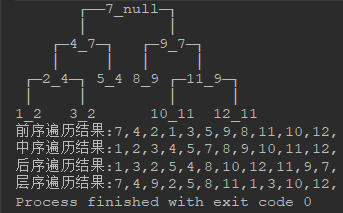

此系列是我数据结构的学习笔记，观看视频课程，网上有很详细的笔记了，所以很多地方没有再展开，着重写下自己的感悟以及记录一些细节。

本篇博客分享主题：「二叉搜索树」。

## 基本认识

二叉搜索树(Binary Search Tree),又叫做二叉查找树、二叉排序树。

- 任意一个节点的值都`大于`其`左子树`所有节点的值。
- 任意一个节点的值都`小于`其`右子树`所有节点的值。
- 它的`左右子树`也是一颗二叉搜索树。


为什么要引入二叉搜索树，需求是什么？

+ 在数组中插入元素，搜索操作平均时间复杂度O(n)，插入操作复杂度O(1)

+ 排好序的数组，二分搜索，最坏时间复杂度O(logn),但插入、删除操作平均复杂度是O(n)

+ 使用二叉搜索树，添加、删除、搜索的最坏事件复杂度均可优化至：`O(logn)`

从二叉搜索树的定义来看，涉及到比较操作，所以二叉搜索树存储的元素必须具备可比较性。


## 基本操作

```java
public class BinarySearchTree<E>{
    private int size; // 元素的个数
    private Node<E> root; // 根节点
    private Comparator<E> comparator; // 比较器

    // 元素的数量
    public int size() 
    // 是否为空
    public boolean isEmpty() 
    // 清空所有元素
    public void clear() 
    // 添加元素
    public void add(E element) 
    // 删除元素
    public void remove(E element) 
    // 是否包含某元素
    public boolean contains(E element) 
}

```

详细实现思路点击[这里](https://juejin.im/post/5dfc735ee51d45582d3405de)。

## 实现接口时的注意细节

1. comparable和comparator？

2. add操作如果遇到相等的情况，为什么要覆盖？


## 常用方法

### 遍历(适用所有二叉树)



1. 前序遍历(Preorder)，访问顺序： `根节点` -> `前序遍历左子树` -> `前序遍历右子树`
递归实现。
   **非递归实现** ？！！！待解决

2. 中序遍历(Inorder)，访问顺序：`中序遍历左子树` -> `根节点` -> `中序遍历右子树`

   中序遍历的结果是有序的，因为根据BST的定义，左<中<右。

3. 后序遍历(Postorder)，访问顺序：`后序遍历左子树` -> `后序遍历右子树` -> `根节点`

4. 层序遍历(Level Order)，访问顺序：`从上到下`，`从左到右`依次访问节点。

引入新的问题： 我们是打印逻辑写死在遍历的方法体内，但是并不是所有遍历都是做打印操作，如何自定义对遍历的元素操作的方法？

设计遍历接口。然后以此接口作为遍历方法的参数，在遍历方法内部调用该接口的遍历操作方法。以便动态指定遍历时对元素的操作。

再次引入新的需求: 遍历到指定条件就终止遍历。


## 陌生知识点

Queue接口的 [offer/poll](https://blog.csdn.net/qq_36101933/article/details/83145869)。


## 感受

比较器comparable与comparator的使用 [详情](https://www.cnblogs.com/qq1083735206/p/6242205.html)

策略模式的体现！。


前中后层四种遍历。

非递归写法还没完成！！。。

[为什么只给出前序和后序，不能唯一确定一个二叉树](https://blog.csdn.net/yusiguyuan/article/details/42687623)